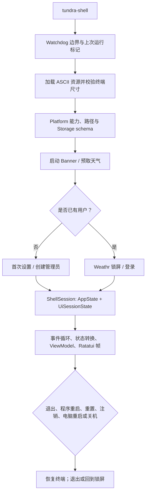
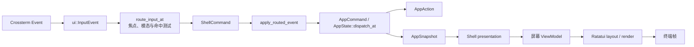
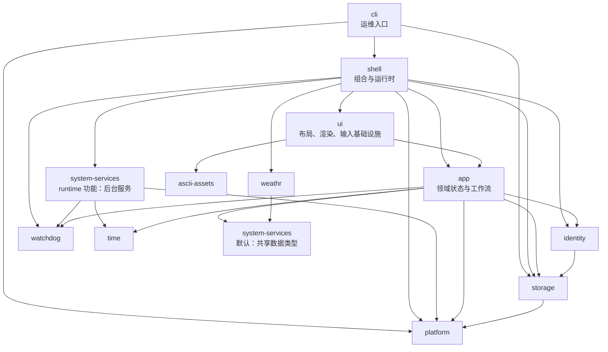

# TundraUX3 技术文档

TundraUX3 是一个以 Rust 编写的终端桌面环境实验项目。它在一个全屏 TUI 会话中串联首次配置、账户登录、Weathr 锁屏、主页、时钟、文件管理、应用启动器、纯文本编辑器、设置、用户管理、诊断与通知中心。本文面向开发、构建、打包和排障；用户入口二进制仍为 `tundra-shell` 与 `tundra-cli`。

## 目录

- [项目定位、平台与环境](#项目定位平台与环境)
- [快速构建与运行](#快速构建与运行)
- [启动与事件流](#启动与事件流)
- [架构与 crate 分工](#架构与-crate-分工)
- [状态、会话与渲染](#状态会话与渲染)
- [内置应用](#内置应用)
- [平台适配](#平台适配)
- [持久化与身份安全](#持久化与身份安全)
- [Watchdog 与故障恢复](#watchdog-与故障恢复)
- [CLI 与交互](#cli-与交互)
- [测试与 CI](#测试与-ci)
- [Linux 打包](#linux-打包)
- [third_party](#third_party)
- [故障排查](#故障排查)
- [架构约束](#架构约束)
- [许可证](#许可证)

## 项目定位、平台与环境

项目以 `crossterm` 适配终端输入输出，以 Ratatui 处理布局和绘制；应用状态、UI 基础设施、平台能力、持久化、身份认证及进程监督被拆分为独立 crate。它不是图形桌面环境或窗口管理器，而是运行于真实终端中的统一 Shell 体验。

| 项目元数据 | 值 |
| --- | --- |
| workspace 版本 | `0.1.1` |
| Rust edition | `2024` |
| Cargo resolver | `3` |
| release panic 策略 | `unwind` |
| 主要终端 UI | Ratatui + crossterm |

支持 Windows 11、macOS 与 Linux。Linux 首发目标为 x86_64 上的 systemd/Freedesktop 普通桌面会话，包括 Ubuntu LTS、Fedora、GNOME/KDE 与 Wayland/X11；无需 root。Windows 平台要求 Windows 11 build 22000 或更高。

运行时应使用兼容 crossterm 的真实终端，例如 Windows Terminal、iTerm2 或其他兼容实现。默认资源集至少需要 **108 × 20** 个终端单元格；内建 Command Line 在 Tundra 顶栏和状态栏之外需要 108 × 22。程序会综合实际加载的 ASCII 资源、Shell 布局与 Weathr 资源计算下限，因此自定义较大资源会相应提高要求。

Linux 还需要 `xdg-utils` 与 `libglib2.0-bin`；推荐有 session D-Bus、xdg-desktop-portal、polkit 和 XWayland。Wayland data-control 不可用时，XWayland 可作为剪贴板兼容层。

## 快速构建与运行

需要安装支持 Rust 2024 edition 的稳定版 Rust 与 Cargo。在仓库根目录执行：

~~~console
cargo build -p shell -p cli
~~~

发布构建：

~~~console
cargo build --release -p shell -p cli
~~~

调试构建的入口如下；发布构建位于对应的 `target/release/` 目录：

- `target/debug/tundra-shell`（Windows 为 `tundra-shell.exe`）
- `target/debug/tundra-cli`（Windows 为 `tundra-cli.exe`）

启动完整 Shell：

~~~console
cargo run -p shell --bin tundra-shell
~~~

首次启动会创建存储并进入设置向导，完成首个管理员账户创建后，后续启动依次显示 Weathr 锁屏与登录界面。

常用 CLI 探查命令：

~~~console
cargo run -p cli --bin tundra-cli -- --help
cargo run -p cli --bin tundra-cli -- debug asset
cargo run -p cli --bin tundra-cli -- debug asset banner
cargo run -p cli --bin tundra-cli -- debug asset home_icons --launcher
cargo run -p cli --bin tundra-cli -- debug asset launcher_icons --builtin.command-line
cargo run -p cli --bin tundra-cli -- cls
cargo run -p cli --bin tundra-cli -- debug doctor
cargo run -p cli --bin tundra-cli -- debug paths
cargo run -p cli --bin tundra-cli -- repl
~~~

其中第一个 `--` 用于结束 Cargo 自己的参数；其后才是传递给 `tundra-cli` 的参数。

## 启动与事件流

### 启动生命周期

`tundra-shell` 的正常启动分为以下阶段：

1. `main` 创建进程级 `WatchdogRuntime`，安装 `ProcessWatchdog`、终端紧急恢复函数，并检查上次未正常关闭的运行标记。
2. 加载 `ascii-assets` 默认主题，计算共同最小终端尺寸；尺寸不够时在进入全屏前给出可操作错误。
3. `prepare_shell_startup` 收集平台权限、存储状态和迁移/恢复结果；`storage` 创建目录、校验 schema、迁移旧用户文件，并恢复可重建的损坏文档。
4. 播放启动 banner，并可在受监督任务中预取天气。
5. 用户列表为空时进入首次设置和管理员创建；否则进入 Weathr 锁屏，再转入登录。
6. 构造同时持有 `AppState` 与 `UiSessionState` 的 `ShellSession`，并建立首屏、焦点和命中表。
7. 进入事件循环：采集终端、时间与后台任务事件，分发命令，构造 ViewModel，再布局并绘制一帧。
8. 主运行结果明确区分退出、重启和重置：退出恢复终端后结束；Unix 重启通过 `exec` 保持前台终端组；重置由 Shell 收尾后重新创建初始存储。注销则销毁本次 Shell UI 会话并返回锁屏。支持电脑重启或关机的平台会先保存编辑器恢复数据、恢复终端，再调用对应的系统接口；请求失败时返回退出菜单并显示错误。



### 输入、路由与绘制

Shell 会把 crossterm 事件规范化为 `ui::InputEvent`。键盘保留完整阶段 `Press`、`Repeat`、`Release`，以及 Shift、Control、Alt、Super、Hyper、Meta 修饰键；鼠标保留移动、按下、释放、点击、双击、拖拽与四向滚动，同时还处理 resize、paste 与 focus 事件。



键盘优先交给活跃模态界面和当前焦点组件。鼠标从命中表中选取目标，层级由低至高严格为 `AppContent < AppOverlay < ShellChrome < ShellModal`；重叠同层目标先比较 `z_index`，仍相同时后注册者优先。这避免退出确认、通知模态等输入泄漏到下层应用。

`UiIntent` 是 UI 层的类型化意图契约，可表达 `UiIntent::App(AppCommand)`、焦点、overlay、命中、布局和 redraw 等意图。生产 Shell 的主路径目前仍以 `RoutedEvent`、控制器自身命令与 `ShellCommand` 完成路由和多步工作流；不应把 `UiIntent` 误解为已经取代这条路径的唯一分发机制。

主循环以 250 ms 为 tick 周期运行；每批最多处理 4,096 个就绪事件，并合并连续的 mouse-move 和 resize 事件，既保持其他事件顺序，也避免移动风暴淹没 UI。watchdog 管理的后台任务通过 `mpsc` 发送结果，Shell 在 Tick 中轮询；Launcher 完整性刷新最多 2 个并发任务。后台线程不持有 Ratatui frame，也不得直接更改焦点、命中表或最终绘制。

这不等于所有副作用都已从领域层完全移走。`ExplorerFileService` 与 `LauncherController` 目前仍会在 `apply` 中执行一部分平台、文件系统或存储操作；文档应以该现状为准，不应承诺所有平台 I/O 都先被抽成异步领域结果。

### 终端会话、休眠与恢复

`TerminalGuard` 负责 raw mode、备用屏幕、鼠标捕获、focus 事件和 bracketed paste；其 `Drop` 路径和紧急恢复路径都会还原终端。进入休眠前，Shell 保存编辑器恢复数据并退出全屏；恢复后重新建立终端、刷新平台会话、时间与终端尺寸。

Shell UI 或锁屏发生 panic 后，先恢复终端并保存事故报告，再直接显示独立的全屏 panic 页面，不重建登录界面或弹出 critical 提示框。Shell 收到后台任务的 panic 报告时也进入这个页面。页面采用黑底白字，使用代码中硬编码的叉眼、下弯嘴笔记本电脑 ASCII 图，不读取主题或资源文件；未登录、普通用户和管理员都能看到关键报错文本。页面不显示 incident 编号、恢复说明和报告路径，完整事故报告仍照常保存。按 `R` 重启程序，按 `Q`、`Esc` 或 `Ctrl-C` 退出；方向键、PageUp/PageDown、Home/End 和鼠标滚轮用于查看长报错，缩小窗口也不会触发 Shell 的最小尺寸检查。`prepare_shell_startup` 虽收集存储恢复信息，但 `restored_session_from_storage` 目前固定为 `None`；它不会恢复先前保存的页面或 Shell UI 会话。

## 架构与 crate 分工

### 依赖方向



关键边界是：`app` 不依赖 `ui`、Ratatui 或 crossterm。UI 可以读取应用领域类型，但应用命令不携带坐标、`Rect`、`UiId` 或终端按键。`shell` 是组合根，负责连接终端世界、领域状态、平台副作用与生命周期。

### 12 个 workspace crate

| Crate | 主要职责 |
| --- | --- |
| `app` | `AppState`、`AppCommand`、`AppAction`、只读快照，以及可选的 Editor、Explorer、Launcher、Diagnostics、通知、认证与配置领域模型。 |
| `ascii-assets` | 主题清单、banner、图标、天气世界、时钟字体的加载、校验和尺寸统计。 |
| `cli` | `tundra-cli` 参数解析、诊断、路径查看、公开配置读写、存储重置、资源/动画预览与 Weathr 启动；不依赖 UI。 |
| `identity` | 用户、角色、会话、授权、密码验证与登录锁定；记录由 storage 持久化。 |
| `platform` | Windows/macOS/Linux 的系统路径、终端能力、文件系统、启动外部程序、Trash、电脑重启、关机与系统诊断边界。 |
| `shell` | `ShellSession`、控制器、presentation、终端事件转换、全屏会话、锁屏与应用组合，以及 `tundra-shell` 入口。 |
| `storage` | TOML/版本化 JSON、原子写入、schema 校验、迁移、恢复与存储健康。 |
| `system-services` | 共享天气、时间、存储、网络和系统指标数据；开启 `runtime` 功能后提供天气请求、定位、缓存、时间同步、系统采样及后台刷新。 |
| `time` | `NetworkClock`、`ClockDisplay`、`ClockSnapshot`、HTTP 时间同步与 `TIME_SYNC_INTERVAL`；供 APP、Shell 和后台服务使用。 |
| `ui` | 输入、焦点、命中测试、通用组件、主题、屏幕 ViewModel、布局和渲染；不拥有终端生命周期。 |
| `watchdog` | 进程 panic 边界、受管理任务、恢复策略、运行 journal 与事故报告。 |
| `weathr` | 读取共享快照、绘制天气动画和 ASCII 锁屏场景；资源和显示输入由 Shell 提供。 |

源码按相同边界组织：

```text
crates/
├── app/src/{application,editor,explorer,launcher,diagnostics}/
├── ui/src/{foundation,screens,components,assets,theme}/
├── shell/src/session/{controller,presentation,runtime.rs,ui_state.rs}
├── identity/
├── storage/
├── platform/
├── system-services/src/{model,runtime}/
├── time/src/{clock.rs,network.rs,tests}/
├── weathr/
├── ascii-assets/
├── watchdog/
└── cli/
```

`application` 承载跨应用全局状态；APP 领域模块不包含终端渲染。UI screens 按屏幕拆分 model、layout 和 render；Shell controller 处理工作流编排，presentation 转换状态为 ViewModel，runtime 只掌管生命周期、事件循环和外部副作用。

`system-services-model` 已合并到 `system-services`。`model/` 按天气、时间、存储、网络和系统指标组织数据类型；`runtime/` 按配置、天气提供方、定位、缓存、系统采样和时间同步组织服务代码，`runtime/mod.rs` 负责启动、命令处理和刷新循环。crate 根部统一导出调用方使用的类型，`lib.rs` 只保留模块声明和导出。

`system-services` 默认不开启后台服务。APP 和 Weathr 使用 `default-features = false`，Shell 使用 `features = ["runtime"]`。Cargo 会在同一次构建中合并各调用方开启的功能，因此整个 workspace 构建会包含后台服务；单独构建 Weathr 时则不引入 `reqwest`、`platform`、`watchdog` 或 `time`。`scripts/check-weathr-dependency-boundary.sh` 检查这一点。`time` 保留为独立 crate，因为时钟本身也被 APP 和 Shell 使用；内部将时钟推进与 HTTP 请求分别放在 `clock.rs` 和 `network.rs`。

## 状态、会话与渲染

### `AppState`：可测试的领域状态

`app::AppState` 是 UI 无关的状态聚合：它保存时钟与时区、退出状态、通知、认证会话与用户、配置与外观，以及可选的 Explorer、Launcher、Diagnostics、Editor 状态。

```rust
AppState::dispatch_at(AppCommand, Instant) -> AppAction
AppState::snapshot() -> AppSnapshot<'_>
```

显式传入单调时钟 `Instant`，使通知超时、登录锁定等时间行为可确定地测试。`AppAction` **仅**表示 `Redraw`、`Exit`、`Reboot` 或 `PowerOff`；终端恢复、进程结束与操作系统重启、关机由 Shell 执行。`AppSnapshot` 以借用方式给出一致的只读视图，UI 不能经由快照修改 APP，所有更改都必须形成新的 `AppCommand`。

通知系统包括 4 秒 toast、有键告警、FIFO 模态和可抢占的 critical 模态；响应队列有上限，避免异常输入或后台结果无限积压。

### `UiSessionState`：一次终端会话的状态

`UiSessionState` 保存不应写入领域快照的短暂 UI 数据，包括：

- 屏幕栈、当前焦点、悬停目标、弹窗，以及模态关闭后的焦点恢复上下文；
- 终端尺寸、命中表、拖拽/滚动捕获和最近输入；
- 列表窗口、编辑器菜单、Settings picker 等显示层选择；
- 文件与扫描任务句柄、加载/保存进度及其他运行时资源。

`ShellSession { app, ui }` 统一持有两类状态：它接收 `InputEvent`、完成 Shell 路由和工作流编排，并将领域变更交给 `AppState`。

### ViewModel、布局与渲染

Shell presentation 只从 `AppSnapshot` 加上必要的 `UiSessionState` 组装屏幕 ViewModel。随后 UI 按以下顺序工作：

1. 用终端 `Rect` 计算布局；
2. 用 ViewModel 决定文本、列表、边框与状态样式；
3. 注册与布局一致的命中区域；
4. 交由 Ratatui 写入当前帧。

因此领域逻辑不依赖终端尺寸，布局/渲染也能用固定 ViewModel 和固定 `Rect` 单测。UI 不得直接读取整个 `ShellSession`，更不应在 render 中驱动领域状态转换。

Home 图标由 `home_icons.toml` 同时声明 ASCII 图案和 PNG；Launcher 使用同样的图形策略。检测到 Kitty、Sixel 或 iTerm2 图形协议时，可在 **Settings → Appearance → Theme → Default theme** 选择 ASCII 或图片图标；这一选择随当前用户 Appearance 持久化。普通文本终端会禁用图片选项。PNG 缺失、损坏或无法准备时，一律自动回退到原有 ASCII 图标，且保持既有四行图标区域和等比例居中布局。

### System Status 数据流与权限边界

System Status 的只读数据流为：`platform` 原生采集器 → `system-services` 中由 `Arc`/`watch` 发布的不可变 `SystemSnapshot` → APP 领域快照 → Shell 按角色过滤的 ViewModel 与通知 → UI。前台活动时每 5 秒采样，后台时每 30 秒采样；用户也可以请求即时刷新。存储压力告警只在达到压力条件时产生，各数据项可独立标记为 `Stale` 或 `Unavailable`，不会因单项失败而把整个快照伪装成最新或完全不可用。

管理员和普通用户都可查看完整明细，访客没有 System Status 入口；诊断修复等写操作仍只允许管理员执行。网络 link 仅表示本机网络接口的链路状态，不代表存在默认路由、互联网连接或任一服务可达；采集器不收集 MAC 地址、SSID，也不执行外部 probe。

终端能力边界同样遵循分层：操作系统查询、环境变量和 stdio 访问位于 `platform`，Shell 将结果转换为展示模型，UI 只消费终端字节或 RGBA 图像数据。

### ASCII 资源约束

资源清单固定要求 25 项：20 个文本资源、4 个 TOML art set 和 1 个时钟字体。文本资源只能包含可打印 ASCII；TOML art set 使用 schema v1。图片路径不得是绝对路径或包含路径穿越，并且只允许 GIF、JPEG、PNG、WebP。

资源根可由 `TUNDRA_ASCII_ASSETS_DIR` 指定，也会从二进制同目录查找；Linux 在前两者未命中时再回退至 `/usr/share/tundraux3/assets`。所有资源都会参与尺寸统计，因此资源更新可能改变启动时的最小终端要求。

## 内置应用

### Weathr 锁屏

`WeatherProvider` 支持 Open-Meteo 与 Met Office；但 APP 和启动预取目前固定使用 Open-Meteo，尚未依据 `Config.provider` 选择 Met Office。坐标可来自地址搜索、配置位置或时区对应城市。显式 refresh 会绕过缓存；APP 内存天气缓存 TTL 为 300 秒，天气磁盘缓存为 300 秒，位置、地址和地理编码缓存为 24 小时。Shell 可以在启动时预取天气。

天气标准化结果、昼夜、季节和动画共同决定 ASCII 房屋、树木、云、雨雪和月相等场景。锁屏支持 12/24 小时制、终端 resize、空格继续和 `Ctrl-C`；资源尺寸会抬高共同最小终端要求。Shell 锁屏模式提示进入系统，由 Shell 负责创建 watchdog 与恢复终端。锁屏 UI 发生 panic 时直接进入全屏 panic 页面，等待用户重启或退出。

### Explorer

Explorer 维护过滤、排序、多选、历史、剪贴板、拖放、冲突处理与进度；领域层还描述目录条目和操作结果。平台层完成枚举、复制、移动、重命名、打开与移入系统回收站。`ExplorerTaskEngine` 为复制、移动和回收站操作提供单 worker、取消、暂存、journal/checkpoint 与崩溃恢复；它不是由 `AppState::dispatch_explorer_at` 直接接线。

耗时文件操作会显示阶段进度，名称冲突、删除和清空回收站都先进入确认工作流。与此同时，`ExplorerFileService` 仍会在 apply 路径执行一部分平台、文件系统或存储操作，不能将其描述为所有副作用都已异步抽离。

Windows、macOS 和 Linux 的 Trash 实现均封装在 `platform`，APP 不拼接系统回收站路径，也不直接调用平台命令。

### Launcher 与内建应用

Launcher 存储平台可执行项目及固定顺序，支持图标/列表视图。持久化记录绝对的非链接目标、目标类型、批准者和批准时间；刷新列表和启动前仅检查目标是否仍位于记录的路径，不计算或比较内容指纹、大小、修改时间或类型变化。旧配置中的指纹字段兼容保留但不再使用。脚本、安装包和快捷方式还需要二次确认。扫描和启动由平台适配器与 `LauncherController` 协作，结果回流 APP；`LauncherController` 目前仍会在 apply 路径完成一部分平台、文件系统或存储操作。旧配置中的目录固定项仍可读，但只有可执行条目会被当作可启动项目。

Launcher 固定提供 **Editor**；管理员还会在第一项看到 **Command Line**。这些内建应用不写入 Launcher 配置，不能删除或拖动排序。图标由 `launcher_icons.toml` 中的 built-in application ID 定义。

打开 Command Line 后，`CommandLineHost` 在隔离 PTY 中从自身二进制目录启动 `tundra-cli repl --embedded`，以 `xterm-256color` 运行，并使用有 2,000 行回滚的 vt100 内存屏幕解析子终端单元格，再在 Tundra chrome 中绘制。子进程输出不会直接写入宿主终端；所有 OSC 控制串（包括 OSC 52 剪贴板请求）都会被过滤。`Ctrl+C` 转发给子 CLI，`Ctrl+Shift+X` 紧急终止并清理子进程树（Windows Job Object、Unix 进程组）；输入 `exit` 正常返回 Launcher。子 CLI 以退出码 `75` 请求重置时，Shell 统一完成重置并重启。

### 纯文本编辑器

编辑器以 `Rope` 保存文本，并按 grapheme（用户看到的一个完整字符）移动光标，因此 CJK、emoji 和组合字符不会被截断。它只有纯文本编辑界面，没有 Source/Rich 切换、Markdown 格式按钮或预览。`.md`、`.markdown` 等文件与 `.txt` 一样直接读取和写回原文，Markdown 标记不会被解析成标题、列表或其他富文本内容。

打开和保存由后台任务执行；保存使用精确 revision 的 `SaveSnapshot`，旧 revision 即使成功也不会清除较新 revision 的 dirty 标记。Shell 用文档 fingerprint 发现外部修改，面对未保存内容关闭、打开其他文件或退出时提供保存/丢弃/取消。恢复文件按节流策略写入，避免每次按键落盘。

Settings 的 Editor 分类可配置 Explorer 交给内置编辑器打开的后缀；匹配不区分大小写，支持 `.d.ts` 等复合后缀。清空列表会把所有文件交回系统默认应用。

默认列表包含 Markdown、`.txt`、`.log`、`.json`、`.jsonl`、`.toml`、`.yaml`、`.yml`、`.ini`、`.cfg`、`.conf`、`.xml`、`.csv`、`.tsv`、`.c` 和 `.h`。已有配置中保存的自定义列表继续生效，不会自动追加后缀。

Editor 仅对 `.c`、`.h` 文件启用 C 语法高亮，区分关键字、字符串和字符常量、数字、注释及预处理指令。高亮只改变显示颜色，不改动文件内容；选区颜色优先。程序从完整文本计算并缓存标记的字节范围，滚动时复用，因此跨行注释和横向滚动中的字符串仍能正确着色；编辑、撤销和重做后重新计算。其他后缀保持普通文本显示。

### 时钟、Settings 与 Diagnostics

`time` crate 每 5 分钟按顺序请求 Google、Cloudflare、Microsoft 的 HTTP `Date` 响应头；这不是 NTP。每次连接超时和总超时均为 5 秒。同步成功后，以 UTC 锚点加 `Instant` 推进当前时间，再通过 `chrono-tz` 投影到配置 IANA 时区，避免将 DST 写死为固定偏移。同步失败时保留可信的既有锚点；没有可信锚点才回退系统时间。时钟项目持久化于 `clock.v1.json`。

Settings 的时间设置可使用平台时钟、默认 HTTP(S) 时间服务器或自定义地址。自定义地址仅在返回有效 `Date` 响应头并确认可同步后保存。全局选项写入 `StorageConfig` 并同步 AppState；外观选项写入当前用户账户并即时应用主题。System Status 的 Diagnostics、Logs、Incidents 分别显示健康检查、日志和事故报告，可用 H/L/I 进入，也可分别加入仪表板；右上角不再显示入口按钮。空白处右键先打开添加菜单，确认添加新组件后才进入编辑模式。选中组件通过强调色边框提示，编辑时其余组件边框每两秒切换一次明暗，并显示固定的编辑提示；减少动画时保持静态强调边框。System Overview 详情独立展示 CPU、内存、存储、电池用量条、网络和温度趋势，以及运行时间和主要进程，不受已添加组件影响。Diagnostics 不再通过 O 隐藏跳转到日志页面；Logs 和 Incidents 中的 O/Enter 打开选中的文件。`DiagnosticsTaskRuntime` 是由 watchdog 管理的单 worker，汇总平台能力、存储文档健康、watchdog 报告与日志，修复操作先给出预览再由用户确认。修复存储后会锁存“需要重启”的状态，必须重启才能继续使用已修复的存储。

## 平台适配

### 应用数据路径

| 用途 | Windows | macOS | Linux |
| --- | --- | --- | --- |
| 配置 | `%APPDATA%\TundraUX3\config.toml` | `~/Library/Application Support/TundraUX3/config.toml` | `$XDG_CONFIG_HOME/TundraUX3/config.toml`，默认 `~/.config/TundraUX3/config.toml` |
| 状态 | `%LOCALAPPDATA%\TundraUX3\state` | `~/Library/Application Support/TundraUX3/state` | `$XDG_DATA_HOME/TundraUX3/state`，默认 `~/.local/share/TundraUX3/state` |
| 缓存 | `%LOCALAPPDATA%\TundraUX3\cache` | `~/Library/Caches/TundraUX3` | `$XDG_CACHE_HOME/TundraUX3`，默认 `~/.cache/TundraUX3` |
| 日志 | `%LOCALAPPDATA%\TundraUX3\logs` | `~/Library/Logs/TundraUX3` | `$XDG_STATE_HOME/TundraUX3/logs`，默认 `~/.local/state/TundraUX3/logs` |
| 临时文件 | `%TEMP%\TundraUX3` | 系统临时目录下的 `TundraUX3` | `$XDG_RUNTIME_DIR/TundraUX3`；缺失时为带 UID 的私有 `/tmp` 目录 |

使用 `tundra-cli debug paths` 可同时查看路径模板和解析后的绝对路径。

### Linux 系统用户与运行权限

原生 Linux Shell 在创建线程、打开存储或进入终端 raw mode 前检查有效 UID。
非 root 进程通过 `/usr/bin/sudo -H -- <当前程序>` 重新启动，授权失败则退出；
root 直接启动。所有成功登录的 Linux 用户统一映射为 UX Admin，后续文件操作、
终端和子进程继承 root 权限。选择用户不改变 UID、HOME 或系统桌面会话。

`IdentityBackend::Linux` 使用 `getent passwd` 从 NSS 枚举 root 和
`/etc/login.defs` 中 UID_MIN/UID_MAX 范围内的普通用户，排除非登录 shell。
通过运行时加载的 `libpam.so.0` 调用 `pam_authenticate` 和 `pam_acct_mgmt`，
并核对 PAM 返回的用户名。PAM 服务优先使用 `tundraux3`，便携运行时缺少该配置则
使用系统 `login` 服务。Debian 包提供继承 common-auth/common-account 的配置。
额外秘密提示（如 MFA）暂不支持，会明确拒绝；密码过期需先通过 Linux `passwd` 更新。

Linux 不进入 UX 管理员创建流程，也不回退到 UX 密码验证。系统用户名区分大小写，
UID 形成 `linux-uid-<UID>` 标识。`users.v2.json` 中仅复用对应系统用户的外观、
仪表板和登录时间，时钟按该 UID 标识保存；旧 UX 账号保留但不参与系统登录。
没有对应 UX 档案的 Linux 用户在认证成功后进入已有的 Appearance 个性化页面，
跳过语言、时区和本地管理员创建步骤。新档案的 `personalization_pending` 标记
与登录记录一起保存，只有外观与完成状态保存成功后才进入主桌面；中途退出或
保存失败后会继续要求完成个性化。旧档案缺少此字段时按已完成处理，不重置偏好。
首次个性化仅在当前终端支持图片时选择 Image，否则保存 ASCII；Linux 每次登录
也会重新检查默认主题的图片能力，避免切换用户后丢失 ASCII 回退。
账号增删、密码和角色由 Linux 工具管理，UX 用户页面以只读方式展示系统账号。
`sudo -H` 下存储通常位于 root 的 HOME/XDG 目录，桌面集成也使用 root 的环境。
Explorer 的个人目录和内置命令行的初始文档目录则按当前登录用户名，通过 NSS
查询真实主目录，并读取该用户的 `~/.config/user-dirs.dirs`，支持中文目录名及绝对路径。
这一路径解析不继承 root 进程的 HOME/XDG 环境；账号无法解析时报告错误，
不会将 root 的个人目录当作该用户的目录。切换用户后重新解析，不改变进程权限。
当配置缺失或某项无效时，先检查该用户主目录中已有的英文、简体中文和繁体中文
标准目录；找不到时保留英文默认路径。显式配置的自定义路径及 `$HOME` 禁用设置
始终优先，不因路径暂时不可用而改指向其他目录。配置解析支持行尾注释和 `${HOME}`，
不执行 shell 命令或任意变量展开。
完整依赖和手动验收步骤见 [Linux 运行说明](packaging/linux/README-LINUX.txt)。

### Linux 桌面集成

Linux 与 Windows 同级实现：使用 XDG Base Directory 与 `user-dirs.dirs`，应用自有配置、状态、恢复、日志和临时数据使用私有权限。Explorer 采用 Freedesktop Trash；卷入口只显示本地固定盘和可移动盘，过滤网络及伪文件系统。

| 功能 | Windows | Linux x86_64 |
| --- | --- | --- |
| 默认应用、文件与 URI 打开 | 平台默认程序 | `xdg-open`，后台回收且不阻塞 UI |
| Launcher | 原生应用/快捷方式 | ELF、AppImage、shebang 脚本和经过验证的 `.desktop` 入口 |
| 系统剪贴板 | 原生后端 | Wayland data-control 或 X11/XWayland；失败时重连，Editor 仍可用 bracketed-paste |
| 本地卷与 Trash | 原生后端 | mountinfo/statvfs/sysfs 与 Freedesktop Trash，不退化为永久删除 |
| 关键错误 | 平台提示与日志 | 桌面通知、watchdog 文本报告和 stderr |
| 电脑重启与关机 | Windows 原生 API 与系统权限 | systemd-logind + polkit；分别检查 CanReboot / CanPowerOff，允许系统要求授权 |

`tundra-cli debug doctor` 会报告缺失的 `xdg-open`、`gio`、session D-Bus、portal、polkit、logind 和剪贴板后端，并提供安装或会话建议。缺少桌面助手只降级相应功能；不会改用 shell 字符串执行、`sudo` 或永久删除作为兜底。

首发范围不包括 aarch64、系统镜像、会话切换或 SteamOS 式产品化。

### 程序自更新

Settings 中的 Update 在 Windows 和 Linux 上可用。确认后从 GitHub 下载已检查的指定提交，在本机用已有 Rust 工具链编译，再替换安装目录中的 Shell 和 CLI；不会更新 Linux 软件包、自动安装 Rust 或使用 sudo。安装目录必须允许当前用户写入，Linux 还需要项目构建所需的编译器和开发库。

更新助手保存旧程序，等新 Shell 报告启动成功后才清理备份。替换失败、启动失败或启动超时会恢复旧版本；更新中断后，下次启动会按安装目录内的记录继续或恢复。更新阶段只校验两个程序及其提交和更新协议，不要求源码目录或安装目录下存在 assets；默认主题、自定义主题和用户数据均不参与复制、替换或回滚。启动时仍按原有方式加载本地资源。更新记录使用协议 v2，助手取自已校验的新 CLI，避免旧助手继续要求替换资源；旧协议记录会明确拒绝，保留原文件。Linux 使用无 `.exe` 后缀的程序名并保留执行权限；助手通过 exec 接替原进程，在新 Shell 退出前持续等待，使更新后的程序继续使用前台终端。

主页的退出菜单将程序操作和电脑操作分别写明：Exit TundraUX、Restart TundraUX、Restart computer、Shut down computer，以及 Cancel。操作逐行等宽排列；窗口较矮时缩小行间空白。macOS 暂不提供程序自更新或电脑电源操作；Linux 缺少 logind 或授权时隐藏对应的电脑操作。

### 从 Windows 迁移到 Linux

配置格式兼容，但不会自动导入或重写 Windows 绝对路径。关闭两端 TundraUX3 后，在 Windows 运行 `tundra-cli debug paths` 并备份 `%APPDATA%\TundraUX3\config.toml` 和 `%LOCALAPPDATA%\TundraUX3\state`；在 Linux 再运行 `tundra-cli debug paths`，分别复制到显示的 config 与 state 路径。保留原备份，不要合并两个 state 目录。

全局主题和设置可复用。Linux 登录仅使用系统账号；旧 UX 账户不参与登录，按旧账户 ID 保存的外观和时钟不会自动绑定到系统 UID。Windows Launcher 和最近文件中的绝对路径在 Linux 会安全显示为 Missing，不会猜测性转换；请重新选择或固定对应文件和应用。

## 持久化与身份安全

### 文档、schema 与恢复

`storage` 管理下列主要文档：

| 文件 | 格式 | 内容 |
| --- | --- | --- |
| `config.toml` | TOML，schema 1 | 语言、时区、天气位置、快捷键、外观和各应用设置。 |
| `users.v2.json` | 版本化 JSON，schema 2 | 用户、角色、密码哈希、登录失败和锁定信息。 |
| `state.v1.json` | 版本化 JSON，schema 1 | 通用应用状态。 |
| `recent-files.v1.json` | 版本化 JSON，schema 1 | 最近文件。 |
| `sessions.v1.json` | 版本化 JSON，schema 1 | 可恢复会话数据。 |
| `clock.v1.json` | 版本化 JSON，schema 1 | 时钟、闹钟和计时项目。 |
| `trash/trash.v1.json` | 版本化 JSON，schema 1 | 应用回收站清单。 |

平台文档读取默认限制为 1 GiB，并在读取前后检查长度、修改时间和路径身份；路径逐级拒绝符号链接、junction 与 reparse point。条件写入还会核对文档 fingerprint，将外部修改作为独立冲突返回。写入依次使用同目录临时文件、文件同步、原子替换与父目录同步，避免部分写入；Linux 存储路径进一步使用 `openat` 与 `O_NOFOLLOW` 防止祖先目录被符号链接重定向。

Linux 应用目录为 `0700`；配置、用户、会话、恢复、日志和临时文件为 `0600`。Editor 打开的普通文档不被改变权限。

启动会先校验 schema：**未来 schema 一律拒绝**，以防旧程序覆盖新格式。当前或旧格式无法解析时，原文件会在原位置重命名为 `<文件名>.corrupt.<时间戳>`，随后生成默认文档，并在 Shell 显示恢复提示。旧 `users.v1.json` 会迁移到 `users.v2.json`。

### Identity 与账户保护

以下本地账户规则用于 Windows、macOS 和测试后端；原生 Linux 的账号、密码、锁定与过期策略由上述 NSS/PAM 后端管理，所有登录用户使用最高权限。

密码不以明文持久化，而使用随机 salt 的 Argon2 哈希。密码长度必须为 **10–256** 个字符，不能全为空白，也不能等于规范化后的用户名。认证会话只保存在内存中；用户名匹配不区分大小写，未知用户与错误密码统一返回无效凭据。连续 **5 次**认证失败会锁定账户 **5 分钟**；锁定与失败信息持久化，避免重启绕过。

用户管理区分 Guest、User 与 Admin。文件读写和个人资料操作面向 User/Admin；用户管理、Command Line、Launcher 管理、诊断修复和设置管理仅允许 Admin。最后一个启用的 Admin 受到保护：不能通过删除、禁用或降级令系统不再保有管理员。CLI 明确禁止直接读取或修改用户名、密码等身份字段；必须进入经过授权的用户管理工作流。

## Watchdog 与故障恢复

每个进程只创建一个 `WatchdogRuntime`。它提供进程级 panic 边界、受管理任务/线程、恢复策略、运行 journal 和事故报告；`ManagedTaskGroup` 统一管理线程与 Tokio 任务。所有可能 panic 的生产后台工作都应进入 managed task group，并声明是否可安全重放。

重启策略受重放安全性约束：只有 `Idempotent`，或具备恢复处理器的 `Checkpointed` 任务允许重启；`Never + RestartTask` 组合会被拒绝。

`OperationGuard` 在下列目录以原子方式维护操作 journal：

```text
<data>/watchdog/operations/<app-id>/
```

操作 commit 时删除 journal，未提交的 `Drop` 标记为 `interrupted`。若无法安全恢复，会保留 journal 并阻止同类变更，不能悄然继续执行。

活动运行标记位于 `<data>/watchdog/runs/`，让下次启动能记录本进程未及观察的异常退出。每起事故生成 JSON 和文本报告：主报告目录失败时依次尝试 fallback，再写入 stderr。报告会集中脱敏并限制大小：文本最多 4,096 bytes，数组最多 256 项；默认保留最近 30 起、30 天、总量不超过 50 MiB。调用方也不得将密码、token、剪贴板内容或原始用户输入写入事故上下文。

正常退出和大多数 panic 都应恢复 raw mode、鼠标捕获、备用屏幕、颜色与光标。若进程被强制终止，先重置当前终端，再检查 crashes 报告；下一次启动会利用未关闭的运行标记生成“原因未知”的事故记录。

## CLI 与交互

### Shell 与 CLI 边界

```console
tundra-shell
```

`tundra-shell` 不接收任何命令行参数，包括 `--help`；传入任何参数都会以参数错误退出。它固定进入全屏 UI，应用选择与 Editor 文件打开只能从 UI 发起。

`tundra-cli` 是独立的运维工具，可读取和修改公开配置，但不能向 Shell 传参或绕过 UI 打开 Editor：

```console
tundra-cli <cls|config|debug|new|repl|help>
```

| 命令 | 作用 |
| --- | --- |
| `debug asset` / `debug asset <name>` | 显示资源帮助或渲染指定资源；TOML art set 会输出全部图案。 |
| `debug asset <name> -a` | 原样输出完整资源文件，包括 TOML 元数据。 |
| `debug asset <name> --<item>` | 只输出 TOML 资源中的项目，例如 `home_icons --launcher`。 |
| `cls` | 清空终端历史和可见内容，并将光标移到左上角。 |
| `config` | 查看全部公开配置。 |
| `config get [field]` | 查看 `theme`、`border-shape`、`border-color`、`accent-color`、`language`、`timezone` 或 `address`。 |
| `config set <field> <value>` | 设置边框形状/颜色、强调色、语言、时区或天气地址；`theme` 仅为只读摘要。 |
| `debug doctor` | 检查系统、终端、权限、应用路径、存储和资源；实际探测 Kitty、Sixel、iTerm2 图形协议。 |
| `debug explain` / `debug paths` | 输出启动/边界说明，或输出路径模板和解析路径。 |
| `repl` | 交互命令循环；`exit` 或 EOF 退出，普通输入复用 CLI 命令，`/<command>` 交给固定系统命令解释器并显示退出码。 |
| `debug test-frost` / `debug test-matrix` | 仅播放启动 frost banner 或首次运行 Matrix banner。 |
| `debug view-ui-style [1\|2\|3]` | 不带数字时列出样式；带数字时进入交互 UI / 动画对比预览，不保存设置。 |
| `debug` / `debug help` | 查看所有调试命令。 |
| `debug test-watchdog-error` | 主动生成普通错误报告。 |
| `debug test-watchdog-critical` | 主动生成严重错误报告。 |
| `debug test-watchdog-panic` | 触发真实 panic，进入正常故障处理流程；当前命令行会话终止。 |
| `help` | 输出公开命令帮助。 |
| `new` | 清除已保存的 TundraUX3 数据，重新创建初始存储。 |

调试命令统一使用 `debug` 前缀，不支持 `sudo` 前缀；原顶层调试命令和 `weathr` 命令已移除。Command Line 中可直接输入 `debug test-frost`；外部终端使用 `tundra-cli debug test-frost`。

UI 样式预览可在 Command Line 中运行 `debug view-ui-style 2`，或在外部终端运行 `tundra-cli debug view-ui-style 2`。源码运行方式为 `cargo run -p cli --bin tundra-cli -- debug view-ui-style 2`。预览至少需要 60 × 24 个字符，建议使用 100 × 35 或更大的窗口。

- `1` Glacier：现有带边框组件、直接更新的进度条、tachyonfx 扫入效果。
- `2` Tea：无边框列表与表单、较集中的留白布局、450 ms cubic 缓动进度。借鉴 Bubble Tea 的 Model / Message / Update / View 方式，使用 Rust 和现有 Ratatui 组件实现，没有链接 Go 库。
- `3` Spring：卡片布局、保留速度的阻尼弹簧进度、柔和进入效果。连续选择列表项时，动画从当前值和速度追随新目标。

`F1`–`F3` 切换版本；`F4` 切换减少动态效果；`F5` 或 Replay 按钮重播；`Tab` / `Shift-Tab` 切换焦点；方向键、鼠标和滚轮操作列表；输入框支持文字与粘贴；Open dialog 展示弹窗。`Esc` 先关闭弹窗，再退出预览，`Ctrl-C` 直接退出。不同版本共用列表、输入框、按钮、Dialog 和原生 Gauge，渲染与命中使用同一份布局；低于最小尺寸时暂停组件交互并提示放大窗口。

进度任务为本地模拟；进入时读取全局外观配置中的强调色、边框、动画速度与减少动态效果偏好，预览中的切换仅对本次会话生效。关闭预览会还原终端。实现入口为 `crates/shell/src/style_preview.rs`，页面组合为 `crates/ui/src/style_preview.rs`；常规页面和业务状态不依赖预览模块。

正式 Shell 已采用第 `3` 种 Spring 风格。常规尺寸下主内容区留出一格外边距，主页和启动器卡片、设置分栏使用统一间距，列表、弹窗和卡片复用现有组件与主题的 raised 背景。页面保留各自的信息结构，移除多余外框；小窗口继续使用紧凑布局。绘制和鼠标命中共用布局计算。

页面和对话框入场复用 `crates/shell/src/spring_style.rs` 的柔和扫入和淡入效果。更新下载、编译进度及系统状态用量条的填充复用 `ui::SpringValue` 阻尼弹簧，连续变化时保留当前速度；百分比文字和业务状态始终展示真实值。动画状态仅存在于 Shell 会话中，收敛或离开页面后停止请求重绘。动画速度和减少动态效果沿用外观设置；编辑器和内嵌终端保留不改变文字内容的颜色过渡。预览 `3` 与正式界面共享弹簧计算和入场实现。

两个错误报告测试在 CLI 进程中生成报告，内容明确标注为主动测试，并输出 JSON 和文本报告路径；成功返回 0，写入失败或等待超时返回非零状态。`debug test-watchdog-panic` 不在命令内部捕获：独立 CLI 由最外层 watchdog 捕获、显示严重错误提示并退出；嵌入 Command Line 则以内部退出码 76 请求 Shell 主循环真正触发 panic，恢复终端后直接显示全屏 panic 页面，不经过天气锁屏或登录页面，也不弹出 critical 提示框。

资源与配置示例：

```console
tundra-cli debug asset banner
tundra-cli debug asset explorer_icons
tundra-cli debug asset explorer_icons -a
tundra-cli debug asset explorer_icons --folder
tundra-cli debug asset home_icons --launcher
tundra-cli debug asset launcher_icons --builtin.command-line
tundra-cli debug asset house

tundra-cli config
tundra-cli config get timezone
tundra-cli config set timezone Asia/Shanghai
tundra-cli config set border-shape rounded
tundra-cli config set border-color light-cyan
tundra-cli config set accent-color "#38bdf8"
```

资源名可使用 `debug asset` 帮助列出的完整键，也可用唯一文件名，例如 `house`、`clock_font`。资源、文件或 TOML 条目不存在时会写入 stderr 并返回非零状态。

`config` 不暴露身份字段，`theme` 为只读摘要。`new` 会删除用户配置和状态，执行前应先运行 `tundra-cli debug paths` 并备份。执行 `new` 必须精确输入 `RESET`；`repl --embedded` 是仅供 Command Line 使用的内部入口。嵌入 CLI 不会自行删除正在使用的数据，而是以退出码 `75` 通知 Shell；Shell 统一恢复终端、释放子进程与后台任务、关闭 watchdog、重置存储并重启，再回到首次设置。

### 常用交互

| 输入 | 行为 |
| --- | --- |
| Tab / Shift+Tab | 在当前焦点顺序中向前/向后移动。 |
| Ctrl+C | 请求关闭终端会话；Editor 保留自身语义，Command Line 则转发给子 CLI。 |
| Ctrl+Shift+X（Command Line） | 紧急终止内嵌 CLI 并返回 Launcher。 |
| q 或 Esc（主页） | 打开退出确认。 |
| L（主页） | 注销并回到 Weathr 锁屏。 |
| F2（登录） | 临时切换密码可见性。 |
| y（退出菜单） | 退出 TundraUX，返回终端。 |
| r（退出菜单） | 重启 TundraUX 程序。 |
| b / p（退出菜单） | 重启电脑 / 关闭电脑；仅在系统支持且允许请求时显示。 |
| 方向键 / Tab / Enter（退出菜单） | 选择 / 切换 / 执行当前操作。 |
| n / Esc（退出确认） | 取消退出。 |

Editor、Explorer、Settings 等屏幕还按其工具栏、列表、对话框和输入模式处理方向键、Home/End、PageUp/PageDown、Enter、Space、Backspace、鼠标双击、拖拽和滚动。

## 测试与 CI

本地推荐检查：

```console
cargo fmt --check
cargo check --workspace --locked
cargo test --workspace --locked
cargo build --locked -p shell -p cli -p weathr
```

定向测试：

```console
cargo test -p app
cargo test -p ui
cargo test -p shell
cargo test -p storage
cargo test -p identity
cargo test -p platform
cargo test --locked -p system-services --no-default-features
cargo test --locked -p system-services --features runtime
bash scripts/check-weathr-dependency-boundary.sh
```

CI 覆盖如下：

| 执行环境 | 验证内容 |
| --- | --- |
| Windows | `cargo test --workspace --locked` |
| macOS | `cargo test --workspace --locked --no-run` |
| Ubuntu | `cargo build/test/clippy --workspace --locked`、PTY smoke、打包与 `.deb` 安装验证 |
| Fedora | `cargo build/test --workspace --locked` |

Linux 的自动测试不触碰用户真实 Trash。发布候选可在 GNOME/KDE 普通用户会话运行原生往返 smoke；它只创建临时项，并在成功后恢复和清理：

```console
cargo test -p platform --test native_trash_smoke -- --ignored --nocapture
python3 scripts/linux-shell-smoke.py target/debug/tundra-shell
```

PTY smoke 使用隔离的 XDG 目录和 140 × 40 的真实 PTY 进入 Shell。它默认注入 64 个 SGR 全移动鼠标事件（可通过 `TUNDRA_PTY_MOUSE_EVENT_COUNT` 调整），随后发送空格键哨兵并等待首次设置从 Language 进入 Timezone，以验证鼠标洪峰后的键盘优先级。最后发送 `SIGTERM`，检查终端属性、raw mode、鼠标捕获、备用屏幕和光标均得到恢复。

固定测试重点包括输入阶段/修饰键/paste/focus/双击/拖拽/滚动及高频鼠标事件合并、模态命中和焦点恢复、通知、Editor grapheme 与异步保存、Explorer/Launcher 后台操作、登录锁定与授权、时钟和 DST、storage schema/迁移/原子写入/损坏恢复，以及 watchdog 的 panic 边界、任务回收和事故报告。

预览动画、可行性 POC、无断言在线探针、平凡 getter/cache，以及与上层工作流重复的逐字符或逐像素断言不进入固定 workspace 测试；只有对应明确用户可见回归时才应加入。

较长的单元测试放在相邻的 `tests/模块名.rs` 中，由原模块通过 `#[cfg(test)]` 和 `#[path]` 引入；crate 入口的测试使用 `src/tests.rs`。这样仍可测试私有函数，也不会让测试占据业务源码的大半篇幅。相同操作的不同输入优先用表格循环检查；界面集成测试共用的输出读取函数放在 `crates/ui/tests/support`，不再每个文件复制一份。

## Linux 打包

Linux 发行物面向 x86_64。Ubuntu/Debian 可生成 tarball 与 `.deb`；Fedora 可生成 tarball 与 `.rpm`，其他 Linux 可仅生成 tarball：

```console
bash scripts/package-linux.sh            # Ubuntu/Debian: tar.gz + .deb
bash scripts/package-linux.sh --rpm      # Fedora: tar.gz + .rpm（需要 rpm-build）
bash scripts/package-linux.sh --tar-only # 其他 Linux: tar.gz
```

打包前可先执行：

```console
cargo fmt --check
cargo check --workspace --locked
cargo test --workspace --locked
cargo build --locked -p shell -p cli -p weathr
```

`weathr` 是库 crate，最后一条构建命令确认其可独立构建；终端用户通过 Shell 锁屏使用它，CLI 不再提供天气场景启动命令。

`scripts/package-linux.sh` 只允许在 Linux x86_64 主机运行，默认将产物写入 `dist/`；版本可由 `TUNDRAUX3_VERSION` 覆盖，否则读取 workspace 版本。脚本执行 `cargo build --release --locked -p shell -p cli`，并拒绝将 `/` 或仓库根目录作为输出目录。

- 便携包 `tundraux3-<version>-linux-x86_64.tar.gz` 包含两个二进制、`debug assets/`、根许可证、Weathr 许可证和 Linux 说明。
- Debian 包 `tundraux3_<version>_amd64.deb` 将二进制安装到 `/usr/bin`、资源安装到 `/usr/share/tundraux3/assets`，并附带 desktop entry 与许可证；`--tar-only` 和 `--rpm` 跳过这一产物。
- RPM 包 `tundraux3-<version>-1.x86_64.rpm` 复用相同程序、资源和 desktop entry，使用 Fedora `system-auth` PAM 配置，以 `%config(noreplace)` 保留本地修改；依赖 `xdg-utils`、`glib2`、`pam`、`glibc`、`sudo`，并由 RPM 自动扫描共享库依赖。正式包在 Fedora 43 x86_64 构建并验证安装，其他衍生发行版必须满足其依赖，不承诺旧版 RHEL 系兼容。
- 所有产物在 `SHA256SUMS` 中记录校验和。`.deb` 依赖 `xdg-utils` 与 `libglib2.0-bin`，并推荐 D-Bus 用户会话、portal、polkit 与 XWayland。

## third_party

workspace 通过 `[patch.crates-io]` 将 `vt100 0.15.2` 指向本地 `third_party/vt100`，使项目使用经过本地维护的解析器实现，而不是从 crates.io 解析该依赖。该补丁回移了 `Grid::visible_rows` 的 scrollback 修复，并额外支持 `CSI 3 J`；变更、上游信息和许可应与该目录内的 `README.md`、`TUNDRA_PATCH.md` 和 `LICENSE` 一并审阅。

## 故障排查

### `terminal is too small`

按错误信息给出的尺寸扩大终端。默认要求为 108 × 20，但这不是写死常量：主题或 ASCII 资源变大后，实际最小尺寸也会变化。

### 显示异常、终端未恢复或异常退出

通常终端状态会自动恢复。若宿主被强制终止，先重置终端，再查看日志目录 `crashes` 中的报告；下次启动也会根据运行标记登记异常。不要忽略报告中的已脱敏运行上下文和后台任务信息。

### 路径、权限或 Linux 桌面功能失败

```console
tundra-cli debug doctor
tundra-cli debug paths
```

macOS 的 Explorer Trash 可能需要 Full Disk Access，启动/诊断会提示系统设置。Linux 请安装 `xdg-utils` 与 `libglib2.0-bin`，确认图形会话具有 session D-Bus、portal 和 polkit；Wayland 剪贴板异常时检查 data-control，或启用 XWayland。关机授权被取消或拒绝时，应配置当前登录会话的 polkit，不能以 `sudo` 运行 TundraUX3 规避。

### 配置或状态损坏

不要立刻运行 `tundra-cli new`。先备份 `tundra-cli debug paths` 报告的配置和状态目录，再查看 Shell 恢复提示和日志。Storage 会尽可能保留损坏原件并重建默认文档；`new` 只适用于明确需要彻底重置时。

## 架构约束

- 不得从 `app` 引入 `ui`、Ratatui 或 crossterm。
- `AppCommand` 使用领域语义，不能包含终端坐标、组件 ID、`Rect` 或原始按键。
- 平台路径和 OS API 只经 `platform`；文档格式、schema 与写入只经 `storage`。
- raw mode、备用屏幕、鼠标捕获及进程退出只由 Shell/Weathr runtime 管理。
- ViewModel 由 Shell presentation 组装；UI 仅实现布局、绘制与通用交互基础设施。
- Editor 位置必须保持 grapheme 语义，不能退化为 UTF-8 字节偏移。
- 生产后台任务必须进入 watchdog managed task group，并声明可否安全重放。
- 图像资源是可选增强；协议不支持或资源不可用时必须保持 ASCII 回退，而不是阻断 Shell。

## 许可证

项目根目录代码按 [MIT License](LICENSE) 授权。Weathr 组件另附 [GNU GPL v3 许可文本](crates/weathr/LICENSE.weathr)；分发或再使用时，还应检查对应组件以及 `third_party` 和其他资源的许可要求。
