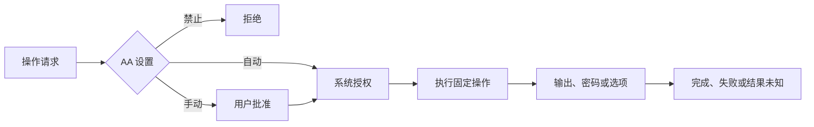

# auto-admin

AutoAdmin（AA）在执行内置管理操作前处理批准，在运行中传递密码、选项和终端输入，并接收最终结果。

| 参与部分 | 负责什么 |
| --- | --- |
| `auto-admin` | 批准后的任务、秘密输入、终端交互、停止请求和 Linux 授权连接 |
| Shell | 弹窗显示、焦点、按钮和返回操作 |
| watchdog | 任务创建、panic 记录和收尾；不决定是否批准 |
| platform | 固定系统操作及实际系统权限检查 |

自动批准只省去 AA 确认，不能替代系统授权或回答程序中的问题。密码不写入日志、参数或配置。写操作不自动重放；连接断开不能被当作执行成功或已回滚。

完整的输入、终止、强制结束和权限要求见[操作流程](docs/workflow.md)。

私有连接、sudo 密码缓存隔离和任务控制接口要求见 [platform 授权说明](../platform/docs/authorization.md)。

验证：`cargo test --locked -p auto-admin`，并运行 Shell 的 AA 界面测试和 Linux 授权交互检查。
