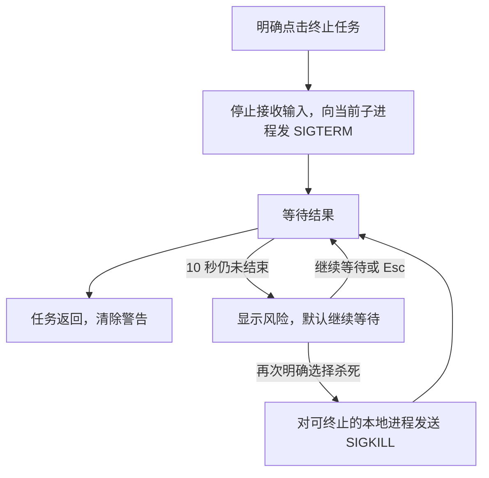

# AutoAdmin 批准与交互

`auto-admin` 执行任务、传递输入并收尾；Shell 控制弹窗和焦点，watchdog 监督线程和记录 panic。各部分分工见 [README](../README.md)。

## 请求与批准

设置 → 系统 → AutoAdmin 保存 `config.toml` 的 `auto_admin`：

| 设置 | 行为 |
| --- | --- |
| `manual`（默认） | 显示操作、目标和非密码参数，用户独立确认后才执行 |
| `automatic` | 跳过 AA 确认；仍等待系统授权、密码和程序问题 |
| `deny` | 启动系统命令前拒绝 |
| 配置不可读 | 拒绝新请求 |

内置系统管理的提权步骤、账户写入和电源操作都从 AA 进入；普通查询不要求批准。用户资料仍在对应页面填写，改密码直接在 AA 输入。AA 不改变系统授权策略，不拦截用户自己输入的命令或外部程序的系统弹窗。

手动确认默认聚焦“同意”，Tab/Shift+Tab/左右键切换，Enter/空格批准；拒绝或 Esc 直接关闭，不再打开拒绝结果页。打开弹窗的按键连发不能继续批准。确认、按钮激活和选项提交都会消费当前按键；同键 Repeat 不进入下一个输入界面。没有松键报告的终端会把连发当成 Press，此时拦截间隔小于 750 ms 的同键；松开报告、其他按键或停止连发后恢复。

任务由 watchdog 创建一次，不自动重放写操作。启动失败或 panic 时显示失败并清除待回答问题，panic 另存事故报告；结束却没有明确结果时显示“结果未知”，不得覆盖已有完成、失败或拒绝状态。

## 运行中的输入

| 焦点/操作 | 行为 |
| --- | --- |
| 终端焦点 | 文字、回车、退格、方向键、功能键、组合键和粘贴发给任务 |
| sudo 或新密码 | 隐藏显示，与操作描述、按键诊断和日志隔离，不保存密码 |
| 后端编号问题 | 输入编号并按 Enter |
| F6 | 在终端与按钮之间切换 |
| 按钮焦点 | Tab/Shift+Tab/方向键选择，Enter/空格执行，Esc 返回终端 |
| 终端内 Tab/方向键/Esc | 交给子终端 |
| Shift+PageUp/PageDown、滚轮 | 查看历史输出 |

软件包使用真实 PTY，直接回答原生 y/n、配置冲突和安装脚本问题。运行时保留 y、n、Enter 按钮，Linux 另有独立一行的“终止任务”。输入只发送到当前一个未结束的请求。

运行中弹窗保持前台，不能收起或操作背景；F12 既不关闭，也不发给任务。任务仍由工作线程执行，弹窗继续接收密码和选项。已准备好的更新等待 AA 结束再重启。完成、失败或断线后保留输出，Enter/空格/Esc 或“关闭”退出；F12 可再查看最近任务，管理页面的终端按钮或 Ctrl+T 打开对应任务。

软件包写入不因普通 Ctrl+C/Ctrl+D/Ctrl+Z 或断线而强制中断，原生确认处仍可回答 n。异常退出后，独立助手任务可从管理页面重新连接；具体授权与保留期限见 [Linux 管理](../../platform/docs/linux-management.md#后台任务与网络回退)。

## 终止和强制结束

SIGTERM 请求进程正常退出，SIGKILL 强制终止。关闭页面、普通取消或断线都不会触发这些信号。Linux 使用 pidfd 保存稳定的进程引用，防止 PID 被复用后误杀；已发现的后代保留到结束，不因父进程退出而丢失。自身密码修改的 passwd 也使用这套控制。

10 秒从点击终止开始计时。警告说明系统、软件包或账户数据可能不完整；Tab/方向键选择，Enter/空格确认，Esc 继续等，PgUp/PgDn 或滚轮查看长提示。没有自动升级为强杀的计时器。

助手等待当前任务子进程退出后才结束本次助手，不结束 Shell 或整个授权会话。发送信号不代表已经结束；内核 I/O 卡住时 SIGKILL 也可能不能立即完成。

仅等待共享 D-Bus 服务、没有独立本地进程的任务只能请求取消；超时说明原因并禁用杀死按钮，不能杀 Shell、AccountsService 或 logind 代替。中断不保证撤销已提交修改，再次执行前应查询真实状态。

## 界面约束

采用 style3：深蓝底、青色边框、AA 分栏标识和背景压暗；窄窗口隐藏左侧标识。弹窗随内容收缩，实际按钮居中，完成后收起空白输出但保留历史。打开/关闭复用全局动画，遵循速度和减少动态效果。通用按钮、点击和焦点规则以 [UI 要求](../../../docs/UI-requirements.md)为准。
