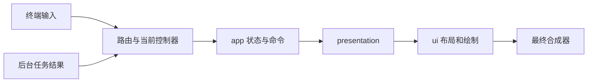

# shell

`shell` 把应用状态、界面、终端输入和后台任务连接起来，提供 `tundra-shell`。它决定当前页面、返回路径、焦点和弹窗，最后合成完整的一帧。

## 分工

| 位置 | 做什么 |
| --- | --- |
| `src/session/controller/` | 按应用分组，处理操作、任务结果和输入路由 |
| `src/session/presentation/` | 把应用状态和会话状态转换成界面需要的数据 |
| `src/session/compositor/` | 按顺序绘制页面、标题栏、状态栏和弹窗 |
| `src/session/navigation.rs`、`overlay*.rs` | 保存页面来路、安排最上层弹窗和恢复焦点 |
| `src/session/runtime.rs` | 事件循环、刷新和退出处理 |
| `src/startup/` | 启动检查、首次设置和启动画面 |
| `src/previews/` | 样式、AA 和屏幕键盘演示 |
| `src/input/` | 终端事件转换和 Shell 输入类型 |

`controller/` 按 account、auto_admin、clock、command_line、diagnostics、editor、explorer、launcher、logs、management、notifications、settings、system_status 分组。页面专用输入放回对应分组，通常使用 `input.rs`；公共路由、焦点和命中逻辑留在 `controller/input/`。

较大的控制器再按实际工作拆分：editor 分为 view/input/settings/files/recovery/tasks；settings 分为 forms/background/view/devices/tasks；management 分为 actions/input/touch/config_editor。入口文件负责连接这些步骤。

终端模式和子终端由 [terminal-runtime](../terminal-runtime/README.md) 管理；批准、密码和任务执行由 [auto-admin](../auto-admin/README.md) 管理。Shell 保留界面控制，不另建任务监督系统。

## 阅读入口

- [会话、导航与绘制](docs/session.md)：启动、输入、焦点、页面返回和异常处理。
- [调试预览](docs/previews.md)：屏幕键盘、AA 输入演示及样式预览。
- [统一 UI 要求](../../docs/UI-requirements.md)：所有页面必须遵守的交互规则。
- [内置应用](../app/docs/applications.md)、[CLI 与 Command Line](../cli/docs/commands.md)。

构建时同时执行 `cargo build --locked -p shell -p cli`，否则内嵌命令行可能继续使用旧 CLI。验证使用 `cargo test --locked -p shell`；终端输入和模式恢复还需对应系统的真实 PTY 检查。
