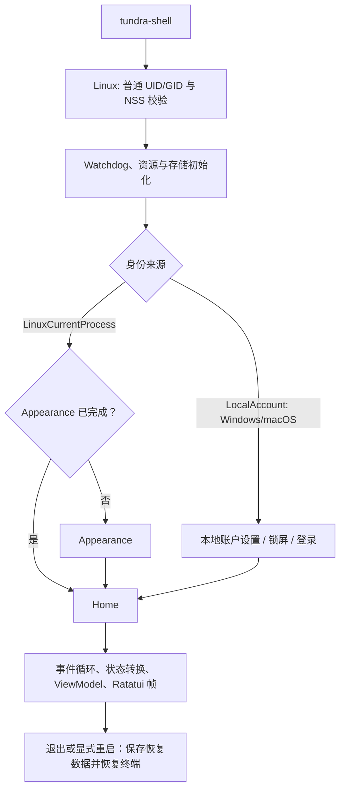
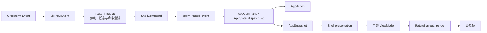

# Shell 会话、导航与绘制

## 启动顺序

`tundra-shell` 的正常启动分为以下阶段：

0. Linux `main` 先验证 UID/EUID 相等、GID/EGID 相等；root 必须在交互终端确认警告后才能继续。随后解析当前 UID 的 NSS 记录并规范化身份环境；失败时直接退出。
1. `main` 创建进程级 `WatchdogRuntime`，安装 `ProcessWatchdog`、终端紧急恢复函数，并检查上次未正常关闭的运行标记。
2. 加载 `ascii-assets` 默认主题，计算共同最小终端尺寸；尺寸不够时在进入全屏前给出可操作错误。
3. `prepare_shell_startup` 收集平台权限、存储状态和迁移/恢复结果；`storage` 创建目录、校验 schema、迁移旧用户文件，并恢复可重建的损坏文档。
4. 播放启动 banner，并可在受监督任务中预取天气。
5. Linux 附着当前用户并按该 UID 的完成标记进入 Appearance 或 Home。Windows/macOS 在本地用户列表为空时创建账户，否则显示锁屏与登录。
6. 构造同时持有 `AppState` 与 `UiSessionState` 的 `ShellSession`，并建立首屏、焦点和命中表。
7. 进入事件循环：采集终端、时间与后台任务事件，分发命令，构造 ViewModel，再布局并绘制一帧。
8. 退出、重启和重置使用不同收尾步骤，见下文。

## 输入与事件循环

Shell 会把 crossterm 事件规范化为 `ui::InputEvent`。键盘保留完整阶段 `Press`、`Repeat`、`Release`，以及 Shift、Control、Alt、Super、Hyper、Meta 修饰键；鼠标保留移动、按下、释放、点击、双击、拖拽与四向滚动，同时还处理 resize、paste 与 focus 事件。

键盘优先交给活跃模态界面和当前焦点组件。鼠标从命中表中选取目标，层级由低至高严格为 `AppContent < AppOverlay < ShellChrome < ShellModal`；重叠同层目标先比较 `z_index`，仍相同时后注册者优先。这避免退出确认、通知模态等输入泄漏到下层应用。

`UiIntent` 可表达应用命令、焦点、弹层和重绘请求；实际 Shell 主路径仍使用 `RoutedEvent`、控制器命令和 `ShellCommand`，没有全部改用 `UiIntent`。

主循环以 250 ms 为 tick 周期运行；每批最多处理 4,096 个就绪事件，并合并连续的 mouse-move 和 resize 事件，既保持其他事件顺序，也避免移动风暴淹没 UI。watchdog 管理的后台任务通过 `mpsc` 发送结果，Shell 在 Tick 中轮询；Launcher 完整性刷新最多 2 个并发任务。后台线程不持有 Ratatui frame，也不得直接更改焦点、命中表或最终绘制。

Unix 终端输入先在 crossterm 本地补丁中完成报文组装与校验，再转换为 `ui::InputEvent`。单独的 ESC 最多等待 50 ms，以兼容转义前缀跨读取边界到达；普通报文使用 250 ms 空闲超时和 4,096 字节上限，括号粘贴使用 5 s 空闲超时和 1 MiB 上限。非法、超时残缺和超长报文会被丢弃，迟到尾部不会回放成快捷键；未完成的粘贴需等到结束标记才能恢复普通输入。警告写入 `ux.terminal.input`，错误码为 `UX_TERMINAL_INPUT_MALFORMED`、`UX_TERMINAL_INPUT_INCOMPLETE` 或 `UX_TERMINAL_INPUT_TOO_LONG`，只记录类型、原因与缓冲字节数，不记录原始输入。正常分段报文会继续拼接，独立 ESC 和有效快捷键仍可使用。

应用的文件与启动器命令仍可能直接读写平台或存储，见 [app 分工](../../app/README.md)。

## 会话状态

`UiSessionState` 保存不应写入领域快照的短暂 UI 数据，包括：

- 屏幕栈、当前焦点、悬停目标、弹窗，以及模态关闭后的焦点恢复上下文；
- 终端尺寸、命中表、拖拽/滚动捕获和最近输入；
- 列表窗口、编辑器菜单、Settings picker 等显示层选择；
- 文件与扫描任务句柄、加载/保存进度及其他运行时资源。

`ShellSession { app, ui }` 统一持有两类状态：它接收 `InputEvent`、完成 Shell 路由和工作流编排，并将领域变更交给 `AppState`。

## 页面返回

`session/navigation.rs` 中的 `ShellNavigation` 保存实际打开路径和各层离开前的焦点，例如 `Home → Launcher → UserManagement`。存储为私有字段，对外的 `ShellSession::screen_stack()` 只提供只读切片。页面调用 `enter_screen`、`return_from_screen`，不能直接增加、删除或清空页面栈；登录、登出、首次设置和会话恢复通过 `reset_navigation` 切换根页面。重复打开当前页面不会多压入一层，关闭请求与当前页面不匹配时不会误退其他页面。

Esc 统一进入 `route_back_key`；返回按钮经过共享的按下、松开检查，再由 `normalize_shell_navigation_input` 转成相同的输入。Shell 弹窗优先接收取消操作，页面控制函数继续处理菜单关闭、表单取消、未保存内容确认、详情返回等本地操作。只有可以离开页面时才调用导航管理器，恢复实际调用页面及其焦点。AA 弹窗也使用共享返回按钮，再按自身当前状态处理 Esc；命令行保留物理 Esc 与强制退出按钮的区别。长按 Esc 的重复事件不会连续退出多层。

编辑器开始打开文件时，导航管理器记录变更前的路径和页面访问编号。取消或失败时恢复原来的调用页面或文件选择器，并保留后来打开的上层页面；若原来的页面已经离开或重新打开，迟到结果不会改写新路径。打开文件成功则保留编辑器的实际来路。文件选择器再次使用文件管理页面时，导航条目保存先前目录、选中项和浏览状态，返回原来的文件管理页面时恢复，避免只恢复页面名称却丢失列表。

`ScreenCompositor` 只根据最终状态绘制页面、标题栏和弹层。它不决定返回目标，也不在绘制时修改导航。详情页的内部选择、表单内容和清理工作仍属于各页面；页面之间的路径与焦点恢复属于导航管理器。

## 弹窗和焦点

`session/overlays.rs` 汇总当前页面的弹窗和菜单，再叠加通知、退出确认及 AA，提供统一的前后顺序。输入路由、鼠标命中、焦点和动画都读取这份描述；未显示页面中保留的表单不会接收当前页面的输入。Toast 只显示消息，不接管焦点。

`session/overlay_focus.rs` 中的 `ShellOverlayManager` 记录每层弹窗打开前的焦点。打开时把焦点放入弹窗，关闭时恢复下面一层；替换通知时保留原来的恢复位置。弹窗变化会清除之前页面的按下、拖动和点击记录，防止松开鼠标时误触背景按钮。页内的 Tab 顺序继续使用 UI 的 `FocusManager`，表单字段和按钮选择仍由各页面保存。

`session/overlay_input.rs` 把按键、内容区鼠标和粘贴交给最上层弹窗，动画未达到可交互阶段时先拦住输入。菜单和通知会吞掉粘贴，支持粘贴的管理表单与编辑器配置表单则继续接收文字。Esc 仍走上面的导航返回规则，AA 的授权、密码和运行中交互仍由 AA 处理。后台任务继续使用 watchdog 的受管理任务，不增加第二套任务管理器。

## 帧合成

Shell presentation 只从 `AppSnapshot` 加上必要的 `UiSessionState` 组装屏幕 ViewModel。`shell::session::compositor::ScreenCompositor` 负责普通 Shell 每帧的统一合成；runtime 保留事件循环，并调用 `terminal-runtime` 管理终端生命周期。UI 通过借用 ViewModel 的 `ScreenContent` 枚举提供页面内容与页面弹层两个独立绘制阶段，不读取整个 `ShellSession`，也不在 render 中驱动领域状态转换。

每帧以同一份 `ShellFrameLayout` 计算并共享布局：正常尺寸下顶栏与底部状态栏各占三行，中间为 `main`；顶栏最右侧为 `back_button`，底栏进一步划分 `status_message` 与 `time_button`。返回按钮使用 `crates/ui/assets/icons/back.txt` 中的实心左三角图标和共享 Button 组件，在按钮内按下并松开左键后等同于一次 Esc：先按当前页面规则取消弹层或返回，在首页沿用退出确认，在 Command Line 中则触发现有的 Ctrl+Shift+X 强制终止流程，清理子进程树并返回打开命令行的页面；物理 Esc 继续交给子终端，不触发主界面退出。页面内不再放置作用相同的返回或退出按钮；弹窗里的取消、关闭按钮继续保留，文件管理器的历史后退和设置向导的上一步也保留。内容布局、鼠标命中、PTY 可用区域和效果边界使用这套几何信息。页面投影只影响内容区域，顶栏、底栏与时钟保持固定；Toast 限制在状态消息区域，不覆盖时钟按钮。小于最小终端尺寸时，紧凑布局预留顶部一行显示消息和右上角左三角，页面内容及全局弹窗均从下一行开始；无法显示内容的页面继续提示放大窗口。

点击底部 `status_message` 区域会打开“状态详情”，显示点击时正在绘制的完整消息，包括临时提示或错误；之后状态更新不会替换弹窗里的文本。长文本自动换行，可用滚轮、滚动条、方向键、PageUp/PageDown 和 Home/End 阅读，关闭按钮或 Esc 返回。时钟仍独立操作，已有模态弹窗不会被状态详情替换。Command Line 中打开状态详情时，键盘和粘贴交给弹窗，返回按钮先关闭弹窗。

终端按键报告与恢复由 [terminal-runtime](../../terminal-runtime/README.md)负责。按钮颜色、输入方式切换、禁用、按下与松开规则集中于 [UI 要求](../../../docs/UI-requirements.md)，各页面复用共享控件。

合成顺序固定为：

1. 页面内容；
2. 页面自身的弹层；
3. Shell 顶栏、状态栏与 Toast；
4. Shell 级模态对话框；
5. 当前帧动画与效果。

合成器集中管理原有的效果生命周期、帧缓存、减少动态效果和跳过单元格的保护逻辑；编辑器、PTY 文本及终端图片仍遵循原有保护规则。锁屏、启动画面、panic 页面和独立样式预览不进入普通 Shell 合成路径。因此领域逻辑继续与终端尺寸解耦，页面布局和合成顺序可以用固定 ViewModel、`Rect` 与测试终端验证。

Home 图标由 `home_icons.toml` 同时声明 ASCII 图案和 PNG；Launcher 使用同样的图形策略。检测到 Kitty、Sixel 或 iTerm2 图形协议时，可在 **Settings → Appearance → Theme → Default theme** 选择 ASCII 或图片图标；这一选择随当前用户 Appearance 持久化。普通文本终端会禁用图片选项。PNG 缺失、损坏或无法准备时，一律自动回退到原有 ASCII 图标，且保持既有四行图标区域和等比例居中布局。

不可用操作统一使用 `TundraTheme::disabled_style()` 的中性灰色，按钮文字、边框与禁用菜单项不再使用主题弱化色、警告色或额外的 DIM 效果；禁用状态优先于悬停、按下、选中和焦点状态。Settings 保留不可用操作原有的按钮与步进器形态，并将禁用状态注册到共享按钮命中区域；Launcher 的不可用图标卡片使用灰色 ASCII 图标，避免彩色图片覆盖禁用样式。操作权限与执行条件仍由原有控制器检查。

## 退出、休眠与异常

| 请求 | 收尾行为 |
| --- | --- |
| 退出 | 保存恢复数据、收尾任务并恢复终端 |
| 程序重启 | Unix 用 `exec` 保持前台终端组；Windows 原进程等待新进程并传回退出码，避免 PowerShell 抢读键盘 |
| 重置 | 先收尾，再重建初始存储，按正常方式重启 |
| 注销 | Windows/macOS 销毁 UI 会话并回到锁屏；Linux 没有系统注销入口 |
| 电脑重启/关机 | 保存编辑器恢复数据、恢复终端后调用平台接口；失败返回退出菜单并显示原因 |

`terminal_runtime::TerminalGuard` 负责 raw mode、备用屏幕、鼠标捕获、focus 事件和 bracketed paste；其 `Drop` 路径和紧急恢复路径都会还原终端。进入休眠前，Shell 保存编辑器恢复数据并退出全屏；恢复后重新建立终端、刷新平台会话、时间与终端尺寸。

Shell UI 或锁屏发生 panic 后，先恢复终端并保存事故报告，再直接显示独立的全屏 panic 页面，不重建登录界面或弹出 critical 提示框。Shell 收到后台任务的 panic 报告时也进入这个页面。页面采用黑底白字，使用代码中硬编码的叉眼、下弯嘴笔记本电脑 ASCII 图，不读取主题或资源文件；未登录、普通用户和管理员都能看到关键报错文本。页面不显示 incident 编号、恢复说明和报告路径，完整事故报告仍照常保存。按 `R` 重启程序，按 `Q`、`Esc` 或 `Ctrl-C` 退出；方向键、PageUp/PageDown、Home/End 和鼠标滚轮用于查看长报错，缩小窗口也不会触发 Shell 的最小尺寸检查。`prepare_shell_startup` 虽收集存储恢复信息，但 `restored_session_from_storage` 目前固定为 `None`；它不会恢复先前保存的页面或 Shell UI 会话。

## 常用交互

| 输入 | 行为 |
| --- | --- |
| Tab / Shift+Tab | 在当前焦点顺序中向前/向后移动。 |
| Ctrl+C | 请求关闭终端会话；Editor 和 Explorer 用于复制，Command Line 则转发给子 CLI。 |
| Ctrl+Shift+X（Command Line） | 紧急终止内嵌 CLI 并返回打开命令行的页面。 |
| q 或 Esc（主页） | 打开退出确认。 |
| L（Windows/macOS 主页） | 注销并回到 Weathr 锁屏。 |
| F2（登录） | 临时切换密码可见性。 |
| y（退出菜单） | 退出 TundraUX，返回终端。 |
| r（退出菜单） | 重启 TundraUX 程序。 |
| b / p（退出菜单） | 重启电脑 / 关闭电脑；仅在系统支持且允许请求时显示。 |
| 方向键 / Tab / Enter（退出菜单） | 选择 / 切换 / 执行当前操作。 |
| n / Esc（退出确认） | 取消退出。 |

Editor、Explorer、Settings 等屏幕还按其工具栏、列表、对话框和输入模式处理方向键、Home/End、PageUp/PageDown、Enter、Space、Backspace、鼠标双击、拖拽和滚动。

## 各应用快捷键

页面按钮会显示对应快捷键；先用方向键或 Tab 选择项目，再按 Enter，也可执行当前按钮。主页的 E/A/S/M/U 分别打开文件管理器、启动器、设置、系统状态和用户资料；Launcher 使用 Enter 打开、V 切换视图、R/F5 刷新、Delete 移除可管理的外部项目。

新增运维页面的常用按键如下。字母快捷键只在浏览时触发；搜索框、路径框、密码框和表单输入中的字母正常输入，不执行页面操作。任务执行、确认和权限限制与点击按钮一致。

| 页面 | 常用快捷键 |
| --- | --- |
| 文件管理器 | S、Ctrl+F 或 `/` 搜索，F6 排序，F5 刷新；保留原有文件操作快捷键 |
| Linux 服务、进程、软件包、网络、磁盘 | S 搜索，R/F5 刷新，F4 详情，Ctrl+Enter 应用搜索或提交表单，Ctrl+U 清除输入，Ctrl+T 输出；各操作按钮标出字母或功能键，也可用 1–9、0 选择前十项操作 |
| 日志 | O/Enter 打开，R/F5 刷新，L/M/T 按级别/模块/时间筛选，C 清除筛选，I/E 查看相关事故/事件 |
| 系统状态 | E 编辑，A 添加，F4 打开尺寸选择，S 循环尺寸，Delete 删除组件，Ctrl+S 保存布局 |
| 设置 | Enter/空格打开，左右键调节，上下键选择，Tab/Shift+Tab 切换分类；输入弹窗 Enter 应用、Esc 取消 |
| 时钟 | N 新建、M 管理；创建弹窗 F3 新建闹钟、F4 新建计时器、Esc 取消 |
| 登录与账号表单 | 登录密码框按 Enter 登录，F2 显示/隐藏密码；账号表单按 Ctrl+Enter 提交，账号列表各操作按钮显示对应字母 |
| 初始设置 | Ctrl+Enter 继续/提交/完成，时区页 Alt+Left 返回上一步 |
| 编辑器设置弹窗 | T 开关，Tab 选择字段，左右键或 -/+ 调整，R 恢复默认，Ctrl+S 保存，Esc 取消 |

弹窗保留确认和取消按钮及对应提示。页面右上角左三角与 Esc 保持相同作用。

## 退出菜单

主页的退出菜单将程序操作和电脑操作分别写明：Exit TundraUX、Restart TundraUX、Restart computer、Shut down computer，以及 Cancel。操作逐行等宽排列；窗口较矮时缩小行间空白。所有按钮在同一按钮内按下并于 500 毫秒内松开即执行，期间的定时刷新不会取消点击；拖动、移出后松开或失去窗口焦点仍会取消。macOS 暂不提供电脑电源操作；Linux 的固定电源操作由后台调用 logind 并呈现不可用或授权失败，不在绘制菜单时阻塞查询系统服务。
