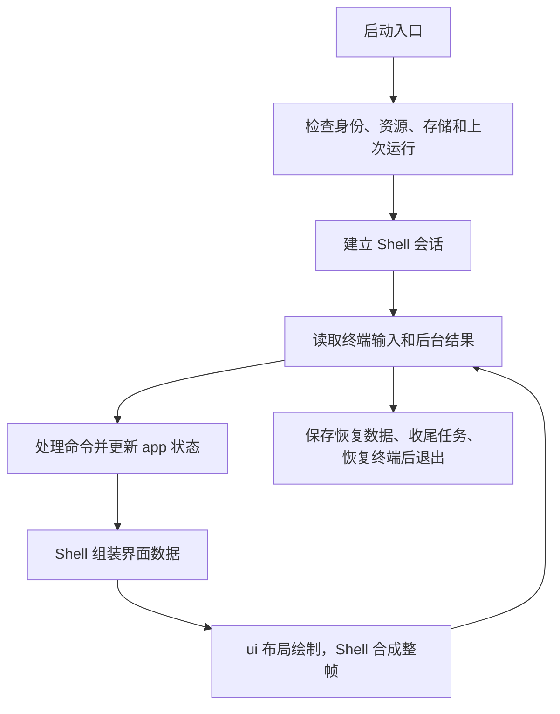
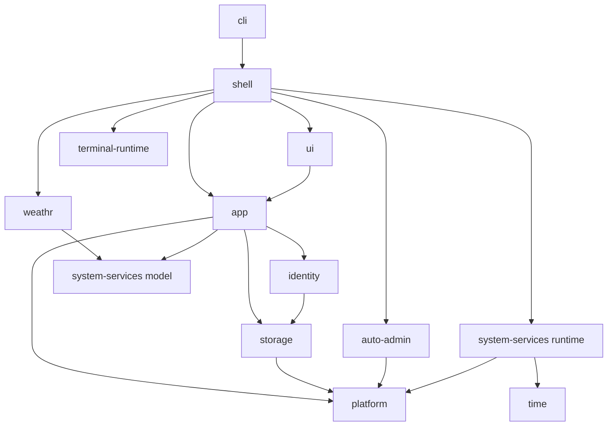

# TundraUX3 技术文档

本文说明整体分工、构建、测试和打包。使用入口见 [中文 README](README.zh-CN.md)；各 crate 的行为、接口和限制放在其目录内，完整导航见[文档索引](README.md)。

## 构建和运行

使用稳定版 Rust 和 Cargo，具体 edition、最低版本声明、功能与依赖以根目录及各 crate 的 `Cargo.toml` 为准。

```sh
cargo build --locked -p shell -p cli
cargo run --locked -p shell --bin tundra-shell
cargo run --locked -p cli --bin tundra-cli -- debug doctor
```

更新源码后仍需一起构建 Shell 和 CLI。`cargo run -p shell` 不会重建它使用的 CLI 可执行文件；发布模式为上述构建命令添加 `--release`。

默认主题需要至少 **108 × 20** 个终端单元格；内建 Command Line 还需要额外垂直空间。实际下限由资源和布局共同计算，自定义大图案可能提高要求。鼠标和触摸输入取决于终端能否转发事件。

Linux 是系统管理的主要目标。使用当前系统用户启动；缺少图形桌面、D-Bus 或某个助手只影响依赖它的功能。Windows/macOS 用于体验界面，保留本地账户和天气锁屏，不承诺同等系统控制功能。运行条件见 [Linux 说明](packaging/linux/README-LINUX.txt)。

## 程序如何工作



Linux 使用当前进程的 NSS 系统用户，首次完成语言、时区和外观设置，之后进入主页。Windows/macOS 使用本地账户设置、登录和锁屏。Shell 的实际启动、焦点和返回规则见[会话说明](../crates/shell/docs/session.md)。

## Crate 分工

下表链接是每个 crate 的文档入口。新增细节写入所属 crate，根文档只维护共有约定。

| Crate | 负责的内容 |
| --- | --- |
| [shell](../crates/shell/README.md) | 页面、焦点、输入路由、弹窗、事件循环和完整帧合成 |
| [cli](../crates/cli/README.md) | 外部命令、REPL、诊断以及内部助手入口 |
| [app](../crates/app/README.md) | 应用状态、命令、文件工作流、时钟调度和更新 |
| [ui](../crates/ui/README.md) | 界面数据模型、布局、绘制和通用控件 |
| [terminal-runtime](../crates/terminal-runtime/README.md) | 宿主终端模式、子终端、输入编码和终端快照 |
| [auto-admin](../crates/auto-admin/README.md) | 操作批准、密码和选项输入、任务收尾及授权连接 |
| [platform](../crates/platform/README.md) | 操作系统路径、文件、进程和系统管理接口 |
| [storage](../crates/storage/README.md) | 应用文档、格式校验、原子保存、迁移和损坏恢复 |
| [identity](../crates/identity/README.md) | Linux 当前用户及 Windows/macOS 本地账户 |
| [system-services](../crates/system-services/README.md) | 共享系统/天气快照及可选后台服务 |
| [time](../crates/time/README.md) | HTTP 时间同步、时间推进和时区转换 |
| [weathr](../crates/weathr/README.md) | 天气场景和锁屏画面 |
| [ascii-assets](../crates/ascii-assets/README.md) | 主题、图案、图标和字体的分发、校验与修复 |
| [i18n](../crates/i18n/README.md) | 语言目录、消息校验、回退和不可变语言快照 |
| [runtime-log](../crates/runtime-log/README.md) | 运行事件、脱敏、日志查询、容量和清理 |
| [watchdog](../crates/watchdog/README.md) | 进程和任务监督、事故报告与操作恢复记录 |

主要调用关系如下，省略日志、翻译等通用依赖；完整依赖以各 `Cargo.toml` 为准。



## 共同约定

| 范围 | 必须保持的行为 |
| --- | --- |
| 应用与界面 | `app` 不依赖 UI、Ratatui、crossterm；命令不携带坐标、组件 ID 或原始按键 |
| 绘制 | Shell 组装 ViewModel；页面只绘制 `ShellFrameLayout.main`，全局栏和弹窗由最终合成器安排 |
| 终端 | Shell 决定生命周期，由 `terminal-runtime` 进入和恢复终端；UI 不操作宿主终端模式 |
| 系统和存储 | 系统接口通过 `platform`；应用文档格式与保存通过 `storage`；系统配置文件另走授权检查和备份流程 |
| 后台工作 | 使用 watchdog 管理任务并声明能否安全重放；AA 批准不能替代任务监督或操作系统授权 |
| 文本 | 编辑器按用户可见的完整字符移动，不能退化为 UTF-8 字节偏移 |
| 资源 | 图片不可用时保留 ASCII 回退；语言和主题独立，完整规则见各 crate |

所有界面以 [UI 要求](UI-requirements.md)为共同验收标准。安全、授权和恢复要求集中在负责实现的 crate，调用方引用同一份说明。

## 验证

在仓库根目录运行：

```sh
cargo fmt --check
cargo test --workspace --locked
cargo build --locked -p shell -p cli
python3 scripts/check-localization.py
bash scripts/check-weathr-dependency-boundary.sh
```

定向改动使用 `cargo test --locked -p <包名>`；跨包接口或影响范围不明确时运行完整 workspace 测试。Linux 检查在本机 WSL/Linux 执行。Windows 使用安装好的 MSVC 工具链，例如 `cargo +stable-x86_64-pc-windows-msvc test --workspace --locked`。

资源紧张时限制编译并发，如 `CARGO_BUILD_JOBS=2 CARGO_INCREMENTAL=0`。回环 HTTP 测试受代理影响时，只给测试进程设置 `NO_PROXY=127.0.0.1,localhost,::1` 和 `no_proxy`。串行测试可加 `-- --test-threads=1`，汇报时说明实际运行方式。

测试目录、PTY、root 启动和 CI 说明见[测试指南](testing.md)。单元测试、模拟后端和只读查询通过，不等于真实桌面、触屏、系统授权或设备写操作已经验收。

## Linux 打包

```sh
bash scripts/package-linux.sh
```

脚本仅在 Linux x86_64 运行，构建 `shell` 与 `cli` 的 release 版本，默认输出到 `dist/`。版本来自 workspace，可用 `TUNDRAUX3_VERSION` 覆盖；`--tar-only` 仍接受且行为相同。发行只提供便携包，不生成 DEB/RPM 安装包。

归档包含两个程序、完整 `assets/`、`tundra-installation.json`、许可证和运行说明，并写入 `SHA256SUMS`。标记须与两个程序一起保留。更新只替换程序，完整恢复规则见 [app 更新说明](../crates/app/docs/update.md)。系统软件包管理与程序自身更新是独立功能。

## 第三方代码和许可证

`[patch.crates-io]` 使用仓库内的 crossterm 和 vt100。修改时一并核对补丁说明、测试与许可：

- [crossterm 补丁](../third_party/crossterm/TUNDRA_PATCH.md)：报文边界、超时、输入限制和警告。
- [vt100 补丁](../third_party/vt100/TUNDRA_PATCH.md)：终端滚动历史和 `CSI 3 J`。

项目代码为 [GPL-3.0-only](../LICENSE)，Weathr 保留 [GPL-3.0-or-later](../crates/weathr/LICENSE.weathr)。资源和第三方代码的许可分别以其说明为准。

## 故障排查

| 现象 | 先做什么 |
| --- | --- |
| 终端太小 | 按错误给出的尺寸放大窗口；自定义资源会改变下限 |
| Command Line 像是旧版本 | 同时重新构建并放置 Shell、CLI，debug/release 目录保持一致 |
| 路径、权限或某项系统功能失败 | 运行 `tundra-cli debug doctor` 和 `tundra-cli debug paths`，检查具体依赖和权限 |
| 异常退出后终端显示不正常 | 重置当前终端，查看日志目录中的 `crashes` 报告和下次启动提示 |
| 配置或状态损坏 | 先备份报告中的路径，查看恢复提示；不要直接执行会清空数据的 `tundra-cli new` |
| Linux 图形打开或剪贴板不可用 | 检查 `xdg-utils`、gio、D-Bus/portal 及终端会话条件；只有依赖它的功能受影响 |
