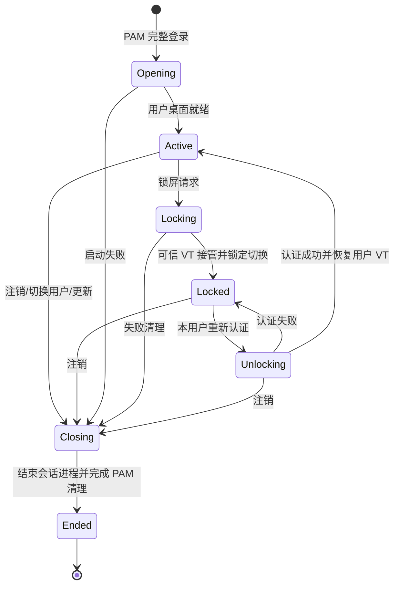

# Linux 用户会话与按需授权

Linux 的桌面身份取自 NSS 与当前 logind 会话。UX 不调用 PAM、不启动 sudo、
不修改系统用户；旧配置中的用户名、密码和角色不构成系统授权依据。
直接启动 tundra-shell 时必须是普通 UID，真实/有效 UID 和 GID 必须一致。
HOME、USER、LOGNAME、SHELL 来自该 UID 的系统账户。

## 进程和权限

- `tundra-sessiond` 是 system D-Bus 上的 root 生命周期服务。独立桌面需要显式
  `--seat`；默认发现模式不会占用控制台，也不会替换已有显示管理器。
- 每个 PAM 事务在单独 exec 的 root worker 内执行。完整登录包含认证、账户检查、
  凭据建立、打开会话；发行版 PAM session stack 通过 pam_systemd 注册 logind。
  worker 留存到会话结束，再关闭 PAM 会话、删除凭据和结束事务。
- `tundra-greeter` 与 kmscon 使用专用系统用户。登录、解锁和系统操作确认仅经过
  root 创建的私有 socketpair。该通道支持多轮 PAM 提示，秘密输入掩码且擦除缓存。
- 用户桌面及其应用在目标用户的 UID/GID/补充组下执行，使用该用户的 HOME、XDG
  配置/数据/缓存/状态目录、`/run/user/UID` 和用户 D-Bus；不继承 launcher 的桌面环境。
- `tundra-privileged` 常驻 root，只接受类型化系统操作：关机、重启、受限日志、
  官方验证更新。没有任意命令、任意文件路径或任意 UID 执行接口。

## 身份与状态转换

每个桌面快照绑定 `(UID, logind session ID)` 和单调 revision。过时事务不能变更
新状态。单个 seat0 只管理一个用户桌面；切换用户会先完全注销旧会话。



锁屏保留用户进程；解锁只重新认证当前 UID，不创建第二个 PAM session。
注销按验证过的会话 cgroup 清理进程，保留 root PAM worker 直至关闭成功，不按 UID
批量杀死其它 SSH/桌面会话。更新必须等注销完成后才进入维护阶段。

可信 tty8 与用户 tty9 使用独立的 kmscon。可信交互由内核 VT 切换锁保护，用户不能
通过切回 tty9 绕过锁屏。可信 renderer、会话或设备移交失败时拒绝授权；daemon
崩溃不会自动释放 VT 锁。实机测试应保留独立 root SSH 恢复通道。

## 系统授权

客户端保持同一个 D-Bus unique name，从 Request 到 GetResult/Cancel 都使用同一连接。
客户端校验服务拥有者为 root 并固定到该 unique name。服务从 system D-Bus 取得调用者
UID/PID，读取进程出生时间、logind 会话、active/remote/locked/seat 属性，并重新查询
root 策略允许的 NSS 管理员组。默认管理员组是 `tundra-admin`，不会自动添加任何用户。

授权前后的身份均须相同，必须属于当前 Tundra Active 会话。确认页面在独立可信界面显示
具体操作，默认取消。确认只消费一次，过期、取消、调用者退出或会话改变均拒绝执行。
取消不会提前释放正在显示的确认窗口所占用的并发名额。状态通过 GetResult 查询，也通过
只发给请求者的 OperationChanged 信号通知；审计不包含密码或返回日志内容。

关机/重启使用 logind `PowerOffWithFlags` / `RebootWithFlags`，仅设置
`SD_LOGIND_ROOT_CHECK_INHIBITORS`，不绕过应用的阻止器。参见
[systemd 官方接口](https://github.com/systemd/systemd/blob/main/man/org.freedesktop.login1.xml)。

更新由独立的包管理器拥有的 maintenance helper 执行，避免服务停止后丢失事务。
完整信任约束和离线迁移命令见 [system-maintenance.md](system-maintenance.md)。

## 普通 UX 与其它平台

普通终端启动的 Linux UX 仍可以运行个人文件、编辑器、设置及应用启动功能。
没有受管理的本地桌面会话时，系统授权拒绝，锁屏返回明确不可用；不会显示假锁屏。
Windows/macOS 保留普通 UX、文件、剪贴板和应用展示能力，不提供 PAM、logind、系统
会话管理或底层关机/提权功能。macOS 不再要求 Full Disk Access 才能启动。

诊断命令：

```
tundra-cli session status
tundra-cli session lock
tundra-cli session logout
tundra-cli session switch
tundra-cli system logs
tundra-cli system update vX.Y.Z
```

`session status` 显示真实用户、logind 身份及受管理快照；其它命令必须满足服务端权限。
安装与发行版依赖请参阅 `packaging/linux/README-LINUX.txt`。
