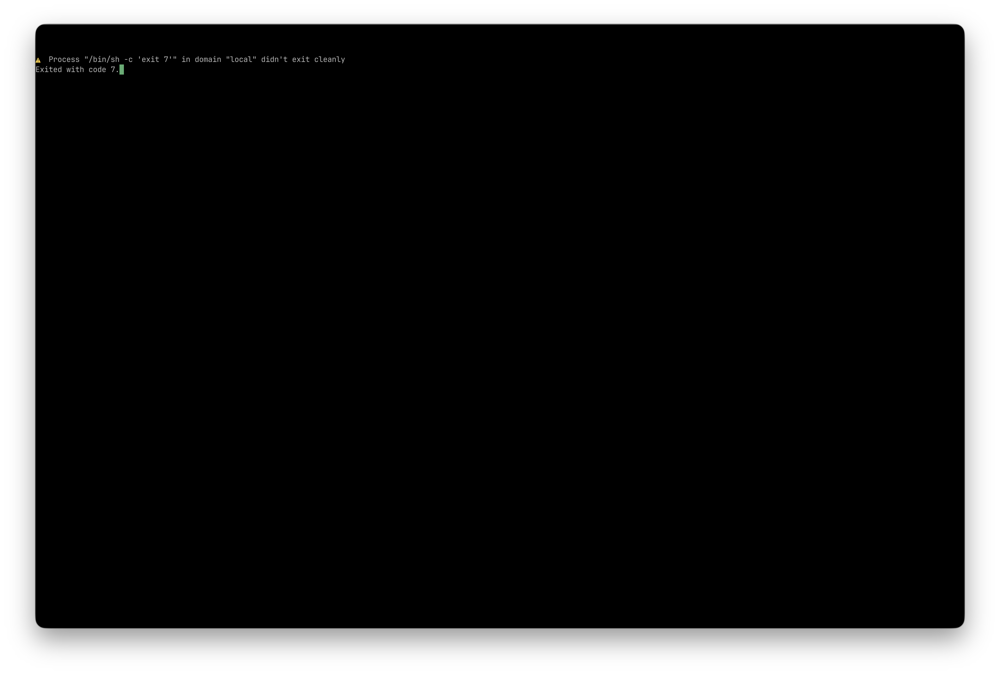

# WezTerm 独立可行性报告

## 结论

**CONDITIONAL GO**（2026-07-18）。

定制 WezTerm 的编译期 kiosk 模式、macOS 双架构构建、单会话硬守卫、配置隔离、受限单实例激活、正常退出和异常诊断已经通过自动测试与本机 smoke。当前不满足 `GO` 的原因是 Windows 11 交互桌面验证，以及 macOS/Windows 的 IME、鼠标、系统快捷键和多显示器人工复测尚未完成。因此本分支不设计、不实现 TundraUX3 启动接入。

解除条件：完成下文“待人工复测”全部项目且没有发现能够创建第二会话、退出 kiosk 全屏或破坏输入法的路径。若发现问题，应在 WezTerm fork 内修复并重新运行本报告的全部测试。

## 版本与仓库

- 上游：`wezterm/wezterm`
- 上游基线：`76b606ec597a3c0263fa60321548637451c0a547`
- fork：`peixuanthomas/wezterm`
- fork 分支：`tundra/kiosk-poc`
- POC 提交：`e378176fd3aa8204ace298157599b5a3b8496ca4`
- Tundra 分支：`codex/wezterm-feasibility`
- submodule：`third_party/wezterm`，保留独立 `Cargo.lock` 和构建链路
- CI：[tundra-kiosk run 29639302931](https://github.com/peixuanthomas/wezterm/actions/runs/29639302931)

## 实现摘要

`tundra-kiosk` feature 未启用时保留上游执行路径；启用后：

- 不读取 `.wezterm.lua`，拒绝 `--config-file`、`--config`、SSH、Serial、Connect、字体和按键查询子命令。
- 每次配置加载/重载后重新施加强制策略，关闭窗口装饰、tab bar、滚动条、padding、自动更新、配置热重载、远程域、启动菜单、默认键鼠绑定。
- 仅保留受控的 macOS `Cmd-C/Cmd-V`、跨平台 `Ctrl-Shift-C/Ctrl-Shift-V` 和硬件 Copy/Paste 剪贴板动作。
- GUI 动作分发和 mux 的 pane/tab/split/spawn 入口均拒绝第二会话；不启动通用 GUI mux server。
- 使用只接受字面量 `ACTIVATE\n` 的本地用户 socket。第二次启动发送激活消息后退出，不接受 spawn 参数。
- 首个窗口显示前进入 simple fullscreen；收到非全屏 resize 状态时恢复全屏；运行期间忽略普通关闭、退出、切换全屏、launcher、命令面板和调试 overlay 动作。
- 子进程返回 0 时关闭；非零退出使用 WezTerm 内建终端诊断并保留窗口，Enter/Escape 关闭诊断页。

保留了上游的 tab/mux 类型，没有进行结构级删除。

## 测试环境

- macOS 26.5.2（25F84）
- Apple M4，arm64
- Rust/Cargo 1.97.1 stable
- macOS 目标：`aarch64-apple-darwin`、`x86_64-apple-darwin`
- GitHub Actions macOS：`macos-latest`；普通/kiosk 检查、策略测试、Apple Silicon/Intel release 构建通过（29m11s）
- GitHub Actions Windows：`windows-2025`、`x86_64-pc-windows-msvc`；普通/kiosk 检查、策略测试和 release 构建通过（52m37s）
- Windows 交互验证仍必须另用 Windows 11 桌面，CI 不能代替 GUI、输入法和多显示器实测

## 构建与自动测试

从 Tundra 仓库根目录执行：

```sh
git submodule update --init --recursive
scripts/wezterm-feasibility/macos-smoke.sh
```

Windows PowerShell：

```powershell
git submodule update --init --recursive
scripts\wezterm-feasibility\windows-smoke.ps1
```

本机已通过：

- `cargo check -p wezterm-gui`
- `cargo check -p wezterm-gui --features tundra-kiosk`
- `cargo test -p config`：9 passed
- `cargo test -p mux`：4 passed
- `cargo test -p wezterm-gui --features tundra-kiosk`：22 passed
- Apple Silicon debug/release kiosk 构建
- Intel `x86_64-apple-darwin` kiosk 交叉构建
- `cargo fmt --all -- --check`

GitHub Actions 已通过：

- macOS：普通/kiosk `cargo check`、kiosk 策略测试、Apple Silicon 和 Intel release 构建
- Windows MSVC：普通/kiosk `cargo check`、kiosk 策略测试和 x64 release 构建

上游现有测试没有因本 POC 产生失败。Rust 1.91.1 无法构建锁文件中的 `fixed 1.31.0`，本机升级到 Rust 1.97.1 后通过；fork 未降级或替换上游依赖。

## 需求结果

| 需求 | 结果 | 证据/说明 |
| --- | --- | --- |
| 普通构建不受 feature 影响 | PASS | 普通与 kiosk `cargo check` 均通过 |
| macOS Apple Silicon 源码构建 | PASS | 本机 debug/release 构建通过 |
| macOS Intel 源码构建 | PASS | 本机 x86_64 交叉构建通过 |
| Windows MSVC 源码构建 | PASS | GitHub Actions `windows-2025` 普通/kiosk 检查、策略测试和 x64 release 构建通过 |
| 无边框、无 tab bar 的 simple fullscreen | PASS | 本机窗口为单一终端画面；见截图 |
| 第二 window/tab/pane/split | PASS | mux/GUI 双层守卫；策略与 GUI 测试通过 |
| 用户配置和 CLI 无法解除约束 | PASS | 两种配置覆盖及 Connect 命令均以 1 退出；配置重载强制重施策略 |
| 通用 mux 控制 socket 不可用 | PASS | kiosk 路径不启动 `spawn_mux_server`，只创建固定 Activate socket |
| 第二次启动只激活现有实例 | PASS | 第二次启动约 0.09 秒返回；前后均为 1 个窗口、1 个 GUI 进程 |
| 返回 0 自动关闭 | PASS | `/bin/sleep 3` 返回后无残留窗口或 GUI 进程 |
| 非零退出保留退出码诊断 | PASS | `/bin/sh -c 'exit 7'` 显示 `Exited with code 7` 并保持窗口 |
| Enter/Escape 关闭诊断 | CODE PASS / MANUAL PENDING | 已实现状态检查与关闭路径；终端应用不允许 Computer Use 注入键盘事件 |
| Cmd-Q、Cmd-N、Cmd-T、Alt-F4 等 | CODE PASS / MANUAL PENDING | 动作分发和普通关闭请求均被拦截，仍需双平台键盘实测 |
| 中文 IME、剪贴板、鼠标报告 | MANUAL PENDING | 安全剪贴板动作已保留；需双平台交互实测 |
| 多显示器、Mission Control、任务栏覆盖 | MANUAL PENDING | 当前只完成单显示器 macOS 截图检查 |
| Windows 11 交互桌面行为 | MANUAL PENDING | CI 只能证明构建与单元测试，不能代替桌面验证 |

### 截图证据



截图同时显示终端界面没有标题栏、tab bar、滚动条和内容 padding；外侧圆角区域是 macOS 窗口截图包含的阴影边界。simple fullscreen 覆盖当前显示器工作区，菜单栏处理和多显示器行为仍列为人工复测。

## 性能与体积观察

这些数据只作记录，不作为硬门槛：

- release `wezterm-gui`：70,240,336 bytes（约 67 MiB）。
- 内置/运行资源目录：fonts 约 13 MiB、icon 约 52 KiB、macOS assets 约 15 MiB；最终 bundle 尚未设计，不能直接相加作为发行包大小。
- 空闲 release 进程：RSS 约 105,040 KiB，采样 CPU 0.0%。
- release 启动 `/bin/sleep 1` 到 GUI 完整退出：2.37 秒；扣除测试程序 1 秒后约 1.37 秒，包含窗口建立、全屏切换与退出清理，不是纯首帧指标。
- 已运行实例的第二次激活：约 0.09 秒。

## Fork 维护成本与风险

- 相对上游修改 13 个文件，约 `+610/-16` 行（包含测试与 CI）。
- 高冲突点：`config/src/lib.rs`、`mux/src/lib.rs`、`wezterm-gui/src/main.rs`、`frontend.rs`、`termwindow/*`。
- 中等风险：macOS simple fullscreen 和 Windows 全屏实现依赖上游窗口后端事件语义；升级上游时必须重跑真实桌面用例。
- 中等风险：single-instance socket 使用固定运行时路径并处理陈旧 socket；并发启动已有单元测试，但崩溃恢复仍应纳入长期回归。
- 中等风险：系统关机/注销与普通关闭在不同平台的消息路径不同；Windows 由系统会话结束消息处理，macOS 由应用终止委托处理，必须在真实关机/注销场景复测。
- 已知上游告警：macOS notification 的 `unused_unsafe`、`block 0.1.6` future-incompatibility，不是本 POC 引入。

## 待人工复测清单

1. macOS：Cmd-Q/N/T/W、全屏退出手势、Mission Control、切换 Space、中文输入法、复制粘贴、鼠标报告、Enter/Escape 关闭诊断、多显示器拔插、注销/关机。
2. Windows 11 x64：MSVC 产物启动、任务栏覆盖、Alt-F4/Win 快捷键、微软拼音、复制粘贴、鼠标报告、第二次启动聚焦、多显示器、注销/关机。
3. 两个平台：同时启动多个进程、主进程崩溃后的陈旧 socket 恢复、子进程被信号/强制结束后的诊断。

在这些条件通过之前，最终状态保持 **CONDITIONAL GO**，不得开始 TundraUX3 launcher、watchdog、安装器或 bundle 接入。
