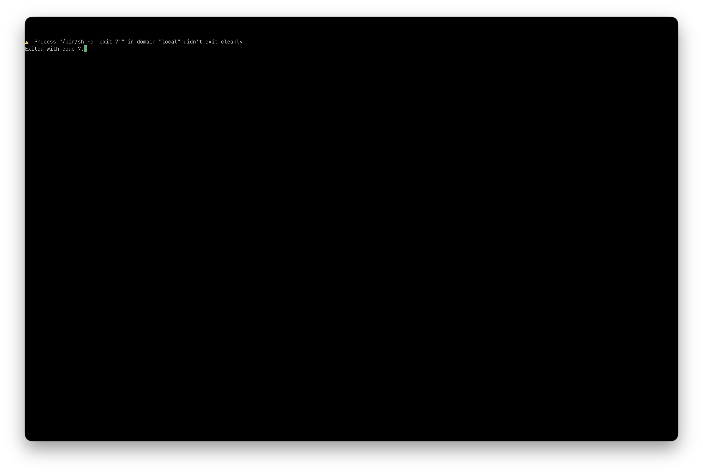

# WezTerm 独立可行性报告

## 结论

**EXPERIMENTAL INTEGRATION**（2026-08-09；原始 POC 结论为 CONDITIONAL GO）。

下文的编译与 smoke 结论属于已归档的 kiosk POC。TundraUX3 仍只以**实验性** launcher/runtime 接入该 fork；它不是稳定发行承诺。Windows 真实 bundle、panic 生命周期和 DPI/二维码自动回读已完成；Windows 的 IME、鼠标、系统快捷键、多显示器及注销/关机人工复测，以及 macOS/Linux 真实构建和桌面验证仍未完成。

2026-08-09 最终实现状态：用户提供的 `wezterm-e378176fd3aa8204ace298157599b5a3b8496ca4.zip` 已校验并离线恢复为精确顶层 pin `e378176fd3aa8204ace298157599b5a3b8496ca4`；freetype2（含 `dlg`）、libpng、zlib、harfbuzz 五个递归子模块也已精确恢复且全部 clean。主仓库已切换至 host protocol v2；fork 的 native `tundra-recovery` no-PTY mode、原生像素二维码、single-instance 和 incident/credential recovery outcome 均已固化为可复现补丁。最终补丁 SHA-256 为 `98d5b893911b4c0b5d7d434d3d67cfc23089e13f14514cc725b25a30d5cb5907`，由 launcher 构建期和 runtime manifest 双重绑定；旧 PTY helper 已退出生产构建与打包链。

Windows 官方工具链已安装并验证：VS 2022 Build Tools 17.14、`cl` 19.44、Windows SDK 26100、Strawberry Perl 5.42.2、NASM 3.02、Rust MSVC 1.97.1。官方 MSVC focused native recovery tests 已 17/17 通过，kiosk config tests 已 2/2 通过。最终 release `wezterm-gui.exe` 为 70,185,984 bytes，SHA-256 `561569e605eab91ad6e4d0c590da6cec2fafb178378ec8f9a423371cf5638bd9`。最终 Windows experimental ZIP 是 `dist/TundraUX3-0.1.1-experimental-windows-x64.zip`，SHA-256 `0d3cb56960f7a70d32f5cdac0bf2053f6f548527f6e1a5841ea944e01eb22774`。MinGW + HarfBuzz C++ ABI 的链接失败仅是历史旁证，并不推翻最终 MSVC 结果。

最终 Windows ZIP 的正常 E2E 证明仅启动一个可见私有 WezTerm 和一个私有 Shell；第二次启动 188 ms 以 0 退出并保留既有 PID；污染 PATH/`WEZTERM_CONFIG_FILE` 不影响私有运行时；无孤儿进程。panic E2E 证明三次重试后进入原生 no-PTY recovery；第二次启动 195 ms 以 0 退出并保留 recovery；Enter 可冷启动，probation 内再次失败直接返回 panic；无 helper 或孤儿进程。2560×1600@144 DPI 截图确认完整红框、二维码和 Enter 提示，`rqrr` 对截图的回读与 capsule 精确一致。

解除条件：完成下文剩余的手机扫描、Windows 多显示器/IME/键鼠/注销关机、macOS/Linux 真实构建/桌面，以及签名、notarization、SBOM 与 stable 切换门禁，且没有发现能够创建第二会话、退出 kiosk 全屏或破坏输入法的路径。若发现问题，应在 WezTerm fork 内修复并重新运行本报告的相关测试。稳定入口没有被替换。

## 版本与仓库

- 上游：`wezterm/wezterm`
- 上游基线：`76b606ec597a3c0263fa60321548637451c0a547`
- fork：`peixuanthomas/wezterm`
- fork 分支：`tundra/kiosk-poc`
- POC 提交：`e378176fd3aa8204ace298157599b5a3b8496ca4`
- Tundra 分支：`codex/wezterm-feasibility`
- submodule：`third_party/wezterm`，保留独立 `Cargo.lock` 和构建链路
- CI：[tundra-kiosk run 29639302931](https://github.com/peixuanthomas/wezterm/actions/runs/29639302931)

## 实现摘要

`tundra-kiosk` feature 未启用时保留上游执行路径；启用后：

- 不读取 `.wezterm.lua`，拒绝 `--config-file`、`--config`、SSH、Serial、Connect、字体和按键查询子命令。
- 每次配置加载/重载后重新施加强制策略，关闭窗口装饰、tab bar、滚动条、padding、自动更新、配置热重载、远程域、启动菜单、默认键鼠绑定。
- 仅保留受控的 macOS `Cmd-C/Cmd-V`、跨平台 `Ctrl-Shift-C/Ctrl-Shift-V` 和硬件 Copy/Paste 剪贴板动作。
- GUI 动作分发和 mux 的 pane/tab/split/spawn 入口均拒绝第二会话；不启动通用 GUI mux server。
- 使用只接受字面量 `ACTIVATE\n` 的本地用户 socket。第二次启动发送激活消息后退出，不接受 spawn 参数。
- 首个窗口显示前进入 simple fullscreen；收到非全屏 resize 状态时恢复全屏；运行期间忽略普通关闭、退出、切换全屏、launcher、命令面板和调试 overlay 动作。
- 历史 POC 中，子进程返回 0 时关闭；非零退出使用 WezTerm 内建终端诊断并保留窗口，Enter/Escape 关闭诊断页。实验 managed 补丁改为把所有退出交回外层，由独立恢复程序只接受 Enter 的事故绑定凭证。

保留了上游的 tab/mux 类型，没有进行结构级删除。

## 测试环境

- macOS 26.5.2（25F84）
- Apple M4，arm64
- Rust/Cargo 1.97.1 stable
- macOS 目标：`aarch64-apple-darwin`、`x86_64-apple-darwin`
- GitHub Actions macOS：`macos-latest`；普通/kiosk 检查、策略测试、Apple Silicon/Intel release 构建通过（29m11s）
- GitHub Actions Windows：`windows-2025`、`x86_64-pc-windows-msvc`；普通/kiosk 检查、策略测试和 release 构建通过（52m37s）
- Windows 交互验证仍必须另用 Windows 11 桌面，CI 不能代替 GUI、输入法和多显示器实测

## 归档与自动测试记录

该 POC 已归档。`third_party/wezterm` submodule 与本报告继续保留，作为实现和历史验证证据；开发期间使用的一次性 macOS/Windows smoke 包装脚本不再保留。以下结果是归档前的验证记录，不表示当前仓库仍提供可直接执行的 smoke 脚本入口。

本机已通过：

- `cargo check -p wezterm-gui`
- `cargo check -p wezterm-gui --features tundra-kiosk`
- `cargo test -p config`：9 passed
- `cargo test -p mux`：4 passed
- `cargo test -p wezterm-gui --features tundra-kiosk`：22 passed
- Apple Silicon debug/release kiosk 构建
- Intel `x86_64-apple-darwin` kiosk 交叉构建
- `cargo fmt --all -- --check`

GitHub Actions 已通过：

- macOS：普通/kiosk `cargo check`、kiosk 策略测试、Apple Silicon 和 Intel release 构建
- Windows MSVC：普通/kiosk `cargo check`、kiosk 策略测试和 x64 release 构建

上游现有测试没有因本 POC 产生失败。Rust 1.91.1 无法构建锁文件中的 `fixed 1.31.0`，本机升级到 Rust 1.97.1 后通过；fork 未降级或替换上游依赖。

## 需求结果

| 需求 | 结果 | 证据/说明 |
| --- | --- | --- |
| 普通构建不受 feature 影响 | PASS | 普通与 kiosk `cargo check` 均通过 |
| macOS Apple Silicon 源码构建 | PASS | 本机 debug/release 构建通过 |
| macOS Intel 源码构建 | PASS | 本机 x86_64 交叉构建通过 |
| Windows MSVC 源码构建 | PASS | GitHub Actions `windows-2025` 普通/kiosk 检查、策略测试和 x64 release 构建通过 |
| 无边框、无 tab bar 的 simple fullscreen | PASS | 本机窗口为单一终端画面；见截图 |
| 第二 window/tab/pane/split | PASS | mux/GUI 双层守卫；策略与 GUI 测试通过 |
| 用户配置和 CLI 无法解除约束 | PASS | 两种配置覆盖及 Connect 命令均以 1 退出；配置重载强制重施策略 |
| 通用 mux 控制 socket 不可用 | PASS | kiosk 路径不启动 `spawn_mux_server`，只创建固定 Activate socket |
| 第二次启动只激活现有实例 | PASS | 最终 Windows ZIP：正常启动 188 ms、panic recovery 195 ms 均以 0 返回，保持既有 PID 且不创建第二套会话 |
| 返回 0 自动关闭 | PASS | `/bin/sleep 3` 返回后无残留窗口或 GUI 进程 |
| 非零退出保留退出码诊断 | PASS | `/bin/sh -c 'exit 7'` 显示 `Exited with code 7` 并保持窗口 |
| Panic 页 Enter/Escape 行为 | PASS（自动验证） | Enter 冷启动与 probation 通过 Windows E2E；Escape inert 和普通关闭不伪造 restart 由状态机测试覆盖 |
| Cmd-Q、Cmd-N、Cmd-T、Alt-F4 等 | CODE PASS / MANUAL PENDING | 动作分发和普通关闭请求均被拦截，仍需双平台键盘实测 |
| 中文 IME、剪贴板、鼠标报告 | MANUAL PENDING | 安全剪贴板动作已保留；需双平台交互实测 |
| 多显示器、Mission Control、任务栏覆盖 | MANUAL PENDING | 当前只完成单显示器 macOS 截图检查 |
| Windows 11 bundle 启动、panic 与 DPI | PASS | 最终 ZIP 直接启动与生命周期验证完成；2560×1600@144 DPI 截图和 `rqrr` QR 回读通过；Explorer 鼠标双击首帧、IME、键鼠、多显示器、注销/关机仍待人工测试 |

### 截图证据

截图同时显示终端界面没有标题栏、tab bar、滚动条和内容 padding；外侧圆角区域是 macOS 窗口截图包含的阴影边界。simple fullscreen 覆盖当前显示器工作区，菜单栏处理和多显示器行为仍列为人工复测。

## 性能与体积观察

这些数据只作记录，不作为硬门槛：

- release `wezterm-gui`：70,240,336 bytes（约 67 MiB）。
- 内置/运行资源目录：fonts 约 13 MiB、icon 约 52 KiB、macOS assets 约 15 MiB；最终 bundle 尚未设计，不能直接相加作为发行包大小。
- 空闲 release 进程：RSS 约 105,040 KiB，采样 CPU 0.0%。
- release 启动 `/bin/sleep 1` 到 GUI 完整退出：2.37 秒；扣除测试程序 1 秒后约 1.37 秒，包含窗口建立、全屏切换与退出清理，不是纯首帧指标。
- 已运行实例的第二次激活：约 0.09 秒。

## Fork 维护成本与风险

- 相对上游修改 13 个文件，约 `+610/-16` 行（包含测试与 CI）。
- 高冲突点：`config/src/lib.rs`、`mux/src/lib.rs`、`wezterm-gui/src/main.rs`、`frontend.rs`、`termwindow/*`。
- 中等风险：macOS simple fullscreen 和 Windows 全屏实现依赖上游窗口后端事件语义；升级上游时必须重跑真实桌面用例。
- 中等风险：single-instance socket 使用固定运行时路径并处理陈旧 socket；并发启动已有单元测试，但崩溃恢复仍应纳入长期回归。
- 中等风险：系统关机/注销与普通关闭在不同平台的消息路径不同；Windows 由系统会话结束消息处理，macOS 由应用终止委托处理，必须在真实关机/注销场景复测。
- 已知上游告警：macOS notification 的 `unused_unsafe`、`block 0.1.6` future-incompatibility，不是本 POC 引入。

## 待人工复测清单

1. macOS：Cmd-Q/N/T/W、全屏退出手势、Mission Control、切换 Space、中文输入法、复制粘贴、鼠标报告、Enter/Escape 关闭诊断、多显示器拔插、注销/关机。
2. Windows 11 x64：MSVC 产物启动、任务栏覆盖、Alt-F4/Win 快捷键、微软拼音、复制粘贴、鼠标报告、第二次启动聚焦、多显示器、注销/关机。
3. 两个平台：同时启动多个进程、主进程崩溃后的陈旧 socket 恢复、子进程被信号/强制结束后的诊断。

在这些条件通过之前，最终状态保持 **EXPERIMENTAL**；不得将 bundled runtime 提升为稳定渠道或替换既有稳定 Shell/CLI 发布物。
